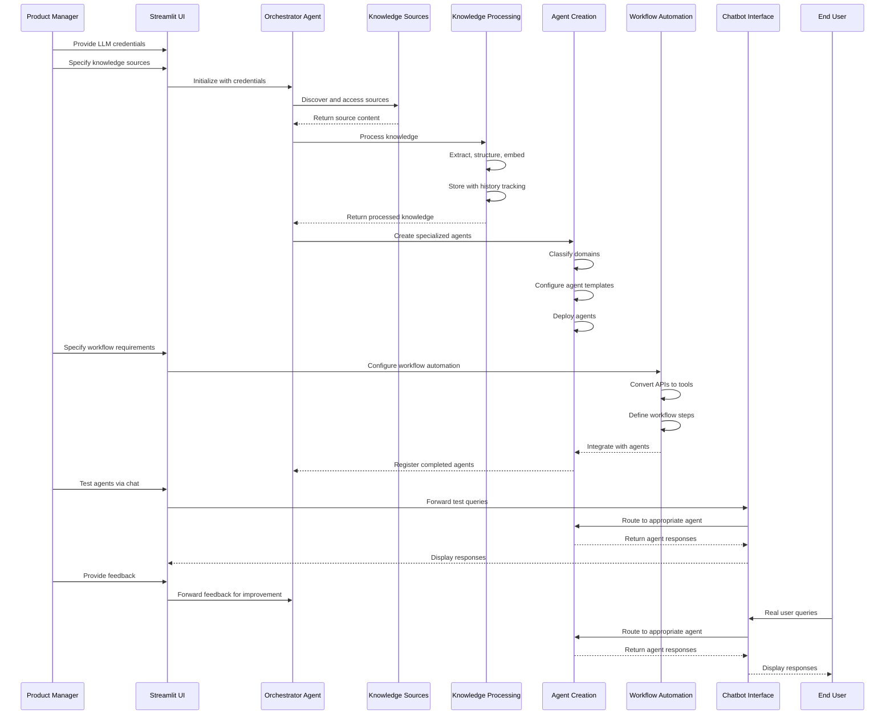

# Product Requirements Document: Autonomous AI Agent Creator

## 1. Product Overview

### 1.1 Product Vision
Create an open-source, autonomous AI agent system that can discover, process, and convert various company knowledge sources into specialized AI agents with minimal human intervention. These agents will function as domain experts within a company chatbot, capable of handling both knowledge dissemination and workflow automation.

### 1.2 Target Users
- **Primary**: Product managers who need to create and manage AI chatbot agents for their companies
- **Secondary**: Developers who want to extend or customize the platform
- **Tertiary**: End users who interact with the created chatbot agents

### 1.3 Key Value Propositions
- **Autonomy**: Minimizes manual effort in creating specialized AI agents
- **Flexibility**: Handles diverse knowledge sources and workflows
- **Accessibility**: Easy to set up and use via Streamlit interface
- **Transparency**: Provides visibility into agent creation and decision-making
- **Adaptability**: Continuously improves through feedback loops

## 2. System Architecture

### 2.1 High-Level Architecture

```mermaid
graph TD
    A[Autonomous Orchestrator Agent] --> B[Knowledge Discovery]
    A --> C[Knowledge Processing]
    A --> D[Agent Creation]
    A --> E[Integration & Routing]
    A --> F[Evaluation & Improvement]
    A --> G[Workflow Automation]
    A --> H[Human Intervention Interface]
    
    B --> B1[Document Scanner]
    B --> B2[Database Connector]
    B --> B3[API Explorer]
    B --> B4[Web Crawler]
    
    C --> C1[Content Extraction]
    C --> C2[Knowledge Structuring]
    C --> C3[Embedding Generation]
    C --> C4[Vector Storage]
    C --> C5[History Retention]
    
    D --> D1[Domain Classification]
    D --> D2[Agent Template Selection]
    D --> D3[Agent Configuration]
    D --> D4[Agent Deployment]
    D --> D5[Dynamic Agent Updates]
    
    E --> E1[Topic Router]
    E --> E2[Context Manager]
    E --> E3[Response Synthesizer]
    
    F --> F1[User Feedback Collection]
    F --> F2[Performance Metrics]
    F --> F3[Knowledge Gap Detection]
    F --> F4[Agent Retraining]
    
    G --> G1[API-to-Tool Conversion]
    G --> G2[Workflow Definition]
    G --> G3[Workflow Execution]
    G --> G4[Workflow Monitoring]
    
    H --> H1[Knowledge Source Review]
    H --> H2[Agent Configuration Review]
    H --> H3[Response Override]
    H --> H4[Manual Retraining]
```

### 2.2 Framework Integration

The system will leverage multiple agent frameworks to maximize autonomy and flexibility:

- **LangChain/LlamaIndex**: Core orchestration and document processing
- **CrewAI**: Multi-agent collaboration and task delegation
- **MCP SDK**: Tool and resource management
- **SmolaGents**: Lightweight, specialized agents for specific tasks
- **Custom Components**: For unique requirements and integrations

### 2.3 Data Flow

## 3. Functional Requirements

### 3.1 Streamlit User Interface

#### 3.1.1 Authentication & Credentials
- User registration and login system
- Secure storage of LLM API credentials
- Role-based access control

#### 3.1.2 Knowledge Source Management
- Interface to add, edit, and remove knowledge sources
- Support for uploading documents
- Configuration for database connections
- URL inputs for web sources
- API endpoint and documentation inputs

#### 3.1.3 Agent Creation & Management
- Dashboard showing all created agents
- Agent creation wizard
- Agent editing and configuration interface
- Agent testing interface
- Version history and rollback capabilities

#### 3.1.4 Workflow Automation
- Interface to define workflows
- API configuration tool
- Workflow testing and debugging tools
- Workflow monitoring dashboard

#### 3.1.5 Monitoring & Feedback
- Performance metrics dashboard
- User feedback collection interface
- Knowledge gap visualization
- System resource utilization monitoring
- Audit logs viewer

### 3.2 Autonomous Orchestrator Agent

#### 3.2.1 Core Capabilities
- Multi-framework agent orchestration
- Decision-making for autonomous operations
- Resource allocation and scheduling
- Error handling and recovery
- State management across operations

#### 3.2.2 Human Intervention Points
- Knowledge source review and approval
- Agent configuration review and modification
- Response override capabilities
- Manual retraining triggers
- System parameter adjustments

### 3.3 Knowledge Discovery & Processing

#### 3.3.1 Supported Knowledge Sources
- Documents (PDF, DOCX, TXT, etc.)
- Databases (SQL, NoSQL)
- APIs (REST, GraphQL)
- Websites and internal wikis
- Structured data (CSV, JSON, XML)

#### 3.3.2 Processing Capabilities
- Multi-format content extraction
- Intelligent chunking strategies
- Embedding generation with model selection
- Knowledge graph construction
- Vector database management
- History retention and versioning

### 3.4 Agent Creation

#### 3.4.1 Domain Classification
- Automatic topic clustering
- Domain boundary detection
- Cross-domain relationship mapping
- Domain priority determination

#### 3.4.2 Agent Templates
- Knowledge-based Q&A agents
- Workflow automation agents
- Multi-tool agents
- Reasoning agents
- Custom template creation

#### 3.4.3 Dynamic Agent Management
- Agent versioning
- A/B testing of agent configurations
- Agent performance monitoring
- Automatic and manual agent updates

### 3.5 Workflow Automation

#### 3.5.1 API-to-Tool Conversion
- API documentation parsing
- Interactive API exploration
- Automatic tool creation from APIs
- Tool testing and validation

#### 3.5.2 Workflow Definition
- Step-by-step workflow creation
- Conditional branching
- Error handling and retries
- Human-in-the-loop steps
- Parallel processing

#### 3.5.3 Workflow Execution
- Scheduled workflows
- Event-triggered workflows
- Manual workflow execution
- Workflow status tracking

### 3.6 Evaluation & Improvement

#### 3.6.1 Feedback Collection
- Explicit user ratings
- Implicit feedback analysis
- Conversation analysis
- Performance metrics tracking

#### 3.6.2 Continuous Improvement
- Automated retraining schedules
- Knowledge gap identification
- Agent behavior optimization
- Workflow efficiency improvements

## 4. Non-Functional Requirements

### 4.1 Security

#### 4.1.1 Authentication & Authorization
- Secure user authentication
- Role-based access control
- API key management
- Session management

#### 4.1.2 Data Protection
- Encryption at rest and in transit
- Secure credential storage
- Access logging and auditing
- Data retention policies

### 4.2 Performance

#### 4.2.1 Scalability
- Horizontal scaling for increased load
- Efficient resource utilization
- Caching strategies
- Asynchronous processing

#### 4.2.2 Response Times
- Agent response time < 2 seconds for standard queries
- Batch processing capabilities for large knowledge sources
- Progress indicators for long-running operations

### 4.3 Reliability

#### 4.3.1 Error Handling
- Graceful degradation
- Comprehensive error logging
- Automatic retry mechanisms
- User-friendly error messages

#### 4.3.2 Data Integrity
- Knowledge source versioning
- Agent configuration backups
- Transaction management for critical operations

### 4.4 Usability

#### 4.4.1 User Interface
- Intuitive, responsive design
- Consistent navigation and interaction patterns
- Helpful tooltips and documentation
- Accessibility compliance

#### 4.4.2 User Experience
- Minimal setup requirements
- Clear feedback on system status
- Guided workflows for complex tasks
- Comprehensive help resources

## 5. Technical Specifications

### 5.1 Technology Stack

#### 5.1.1 Core Technologies
- **Programming Language**: Python 3.9+
- **LLM Integration**: OpenAI API, Anthropic API, local models via LlamaCPP
- **Agent Frameworks**: LangChain, CrewAI, MCP SDK, SmolaGents
- **Document Processing**: LlamaIndex, Unstructured.io
- **Vector Database**: Chroma, FAISS, or Pinecone
- **Knowledge Graph**: Neo4j or custom solution
- **Frontend**: Streamlit
- **API Layer**: FastAPI

#### 5.1.2 Supporting Technologies
- **Containerization**: Docker
- **Version Control**: Git
- **Testing**: Pytest, hypothesis
- **CI/CD**: GitHub Actions
- **Monitoring**: Prometheus + Grafana
- **Logging**: ELK Stack or similar

### 5.2 Deployment Options

#### 5.2.1 Local Deployment
- Docker Compose setup for local development and testing
- Minimal resource requirements specification
- Local model support for reduced API costs

#### 5.2.2 Cloud Deployment
- Deployment guides for major cloud providers
- Infrastructure-as-Code templates
- Scaling recommendations

## 6. Implementation Plan

### 6.1 Phase 1: Foundation (Weeks 1-4)
- Repository setup with documentation
- Streamlit UI basic structure
- LLM credential management
- Simple document processing pipeline
- Basic agent creation with fixed templates
- Initial testing framework

### 6.2 Phase 2: Core Functionality (Weeks 5-8)
- Multi-source knowledge processing
- Advanced agent creation with domain classification
- Basic workflow automation
- Human intervention interfaces
- Feedback collection system
- Comprehensive testing suite

### 6.3 Phase 3: Advanced Features (Weeks 9-12)
- Multi-framework agent integration
- Advanced workflow automation
- Knowledge history and versioning
- Dynamic agent updates
- Performance optimization
- Security hardening

### 6.4 Phase 4: Refinement & Documentation (Weeks 13-16)
- UI/UX improvements
- Comprehensive documentation
- Example templates and use cases
- Community contribution guidelines
- Final testing and bug fixes
- Release preparation

## 7. Success Metrics

### 7.1 Technical Metrics
- **Autonomy Rate**: Percentage of operations completed without human intervention
- **Processing Efficiency**: Time to process knowledge sources of various sizes
- **Agent Quality**: Accuracy of agent responses compared to ground truth
- **System Reliability**: Uptime and error rates

### 7.2 User Experience Metrics
- **Setup Time**: Time required for new users to create their first agent
- **User Satisfaction**: Feedback ratings from product managers
- **Knowledge Coverage**: Percentage of user queries successfully answered
- **Workflow Efficiency**: Time saved through automated workflows

## 8. Risks and Mitigations

| Risk | Impact | Likelihood | Mitigation Strategy |
|------|--------|------------|---------------------|
| LLM API limitations | High | Medium | Support multiple providers, implement rate limiting, add local model support |
| Complex knowledge sources | Medium | High | Develop robust parsing strategies, provide clear error messages, allow manual corrections |
| Security vulnerabilities | High | Low | Regular security audits, follow best practices, limit access to sensitive operations |
| Poor agent performance | Medium | Medium | Implement comprehensive testing, feedback loops, and continuous improvement |
| Resource constraints | Medium | Medium | Optimize resource usage, implement caching, provide deployment recommendations |

## 9. Future Enhancements

### 9.1 Short-term Enhancements
- Additional LLM provider integrations
- More document format support
- Enhanced visualization of agent decision-making
- Expanded workflow automation capabilities

### 9.2 Long-term Vision
- Multi-language support
- Advanced reasoning capabilities
- Collaborative agent networks
- Integration with popular enterprise systems
- Mobile companion app

## 10. Appendices

### 10.1 Glossary
- **Agent**: An autonomous software entity that performs specific tasks
- **Knowledge Source**: Any repository of information that can be processed by the system
- **Workflow**: A sequence of operations that accomplish a specific business process
- **Embedding**: Vector representation of text for semantic search and comparison
- **LLM**: Large Language Model, the foundation of AI agents

### 10.2 References
- LangChain Documentation
- CrewAI Documentation
- MCP SDK Documentation
- SmolaGents Documentation
- Streamlit Documentation
- Vector Database Best Practices