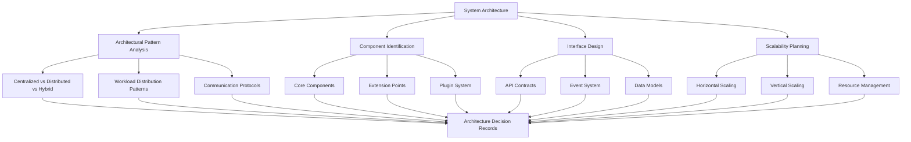
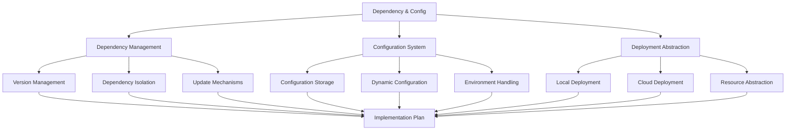
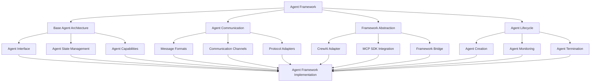
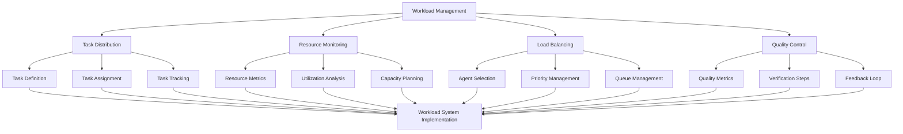
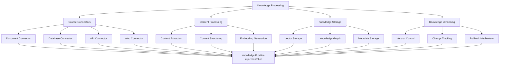
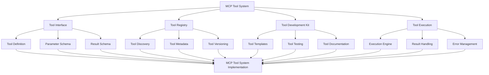
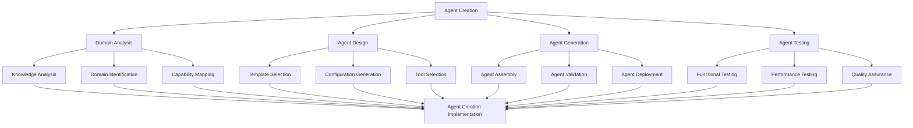
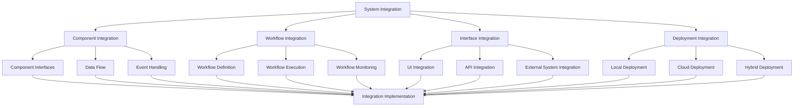
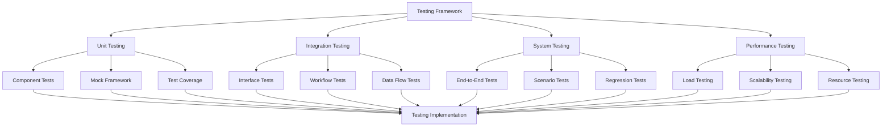

# Action Plan for Autonomous AI Agent Creator System - Part 1

## Table of Contents for Part 1

1. [Architecture & Design Phase](#1-architecture--design-phase)
2. [Core Framework Development](#2-core-framework-development)
3. [Component Development Phase](#3-component-development-phase)
4. [Integration & Testing Phase](#4-integration--testing-phase)

## 1. Architecture & Design Phase

### 1.1 System Architecture Design

#### 1.1.1 Architectural Pattern Analysis
- **Objective**: Determine the optimal architecture for scalability and maintainability
- **Tasks**:
  - Analyze centralized orchestration patterns
  - Evaluate distributed agent collaboration models
  - Assess hybrid approaches with domain-specific autonomy
  - Create decision matrix with pros/cons for each approach
  - Select architecture based on scalability, maintainability, and adaptability
  - Document architecture decisions with rationales

#### 1.1.2 Component Identification & Boundaries
- **Objective**: Define clear, independent modules with minimal coupling
- **Tasks**:
  - Identify core system components with clear responsibilities
  - Define strict interface boundaries between components
  - Create component dependency graph to identify coupling issues
  - Design communication patterns between components
  - Document component lifecycle management

#### 1.1.3 Extension & Plugin System Design
- **Objective**: Create a framework for easy integration of future enhancements
- **Tasks**:
  - Design plugin architecture for system extensions
  - Define extension point interfaces
  - Create plugin discovery and registration mechanisms
  - Design plugin versioning and compatibility checking
  - Develop plugin isolation strategies

### 1.2 Dependency & Configuration Management

#### 1.2.1 Dependency Management Strategy
- **Objective**: Create a robust system for managing Python dependencies
- **Tasks**:
  - Design dependency versioning strategy
  - Create dependency isolation mechanisms (virtual environments, containers)
  - Develop automated dependency update testing
  - Implement compatibility checking for dependencies
  - Design fallback mechanisms for failed updates

#### 1.2.2 Configuration-Driven Development
- **Objective**: Minimize hard coding through comprehensive configuration
- **Tasks**:
  - Design hierarchical configuration system
  - Create configuration validation mechanisms
  - Implement environment-specific configuration handling
  - Develop dynamic configuration updates
  - Design configuration versioning and migration

#### 1.2.3 Deployment Abstraction Layer
- **Objective**: Ensure consistent operation in both local and cloud environments
- **Tasks**:
  - Design resource abstraction layer
  - Create deployment configuration templates
  - Develop environment detection mechanisms
  - Implement resource scaling strategies
  - Design cross-environment testing framework

## 2. Core Framework Development

### 2.1 Agent Framework Foundation

#### 2.1.1 Base Agent Architecture
- **Objective**: Create a flexible foundation for all system agents
- **Tasks**:
  - Design base agent interface
  - Implement agent state management
  - Create capability registration system
  - Develop agent configuration mechanism
  - Design agent metrics collection

#### 2.1.2 Agent Communication System
- **Objective**: Enable efficient, scalable agent communication
- **Tasks**:
  - Design message format standards
  - Implement synchronous and asynchronous communication channels
  - Create message routing system
  - Develop message serialization/deserialization
  - Research and potentially implement A2A protocol adapters

#### 2.1.3 Framework Abstraction Layer
- **Objective**: Allow easy integration of different agent frameworks
- **Tasks**:
  - Create CrewAI adapter
  - Implement MCP SDK integration
  - Design framework-agnostic interfaces
  - Develop framework capability discovery
  - Create framework version management

### 2.2 Workload Management System

#### 2.2.1 Task Distribution System
- **Objective**: Efficiently distribute tasks among agents
- **Tasks**:
  - Design task definition format
  - Implement task assignment algorithms
  - Create task tracking and status reporting
  - Develop task dependency management
  - Design task prioritization system

#### 2.2.2 Resource Monitoring & Management
- **Objective**: Ensure optimal resource utilization
- **Tasks**:
  - Implement resource usage metrics collection
  - Create resource allocation strategies
  - Develop resource constraint handling
  - Design adaptive resource management
  - Implement resource usage forecasting

#### 2.2.3 Quality Control System
- **Objective**: Maintain high quality of agent outputs
- **Tasks**:
  - Design quality metrics for agent tasks
  - Implement verification steps for critical operations
  - Create feedback collection mechanisms
  - Develop quality-based task routing
  - Design continuous improvement processes

## 3. Component Development Phase

### 3.1 Knowledge Processing Pipeline

#### 3.1.1 Source Connector System
- **Objective**: Create extensible connectors for knowledge sources
- **Tasks**:
  - Design connector interface
  - Implement document connectors (PDF, DOCX, etc.)
  - Create database connectors (SQL, NoSQL)
  - Develop API connectors (REST, GraphQL)
  - Build web connectors with configurable crawling
  - Create connector plugin system for future extensions

#### 3.1.2 Content Processing Pipeline
- **Objective**: Transform raw content into structured knowledge
- **Tasks**:
  - Design pipeline architecture with pluggable processors
  - Implement content extraction strategies
  - Create content structuring algorithms
  - Develop embedding generation with model selection
  - Build content validation and quality checks
  - Design incremental processing for large sources

### 3.2 MCP-Compliant Tool System

#### 3.2.1 Tool Interface & Registry
- **Objective**: Create a standardized system for MCP-compliant tools
- **Tasks**:
  - Design tool interface definition
  - Implement parameter and result schema validation
  - Create tool registry with discovery mechanisms
  - Develop tool metadata management
  - Build tool versioning and compatibility checking
  - Design tool dependency management

#### 3.2.2 Tool Development Kit
- **Objective**: Simplify creation of new MCP-compliant tools
- **Tasks**:
  - Create tool templates for common patterns
  - Implement tool testing framework
  - Develop tool documentation generator
  - Build tool packaging system
  - Design tool update mechanisms
  - Create tool migration utilities

### 3.3 Agent Creation System

#### 3.3.1 Domain Analysis System
- **Objective**: Automatically identify knowledge domains and capabilities
- **Tasks**:
  - Implement knowledge analysis algorithms
  - Create domain identification and boundary detection
  - Develop capability mapping from knowledge to tools
  - Build domain relationship mapping
  - Design domain priority determination
  - Create domain metadata generation

#### 3.3.2 Agent Generation System
- **Objective**: Automatically generate specialized agents
- **Tasks**:
  - Design agent template selection logic
  - Implement configuration generation
  - Create tool selection and integration
  - Develop agent assembly pipeline
  - Build agent validation and testing
  - Design agent deployment mechanisms

## 4. Integration & Testing Phase

### 4.1 System Integration

#### 4.1.1 Component Integration
- **Objective**: Ensure seamless interaction between system components
- **Tasks**:
  - Implement component interface validation
  - Create data flow testing
  - Develop event handling and propagation
  - Build integration test suite
  - Design component versioning and compatibility
  - Create integration monitoring

#### 4.1.2 Deployment Integration
- **Objective**: Ensure consistent operation across deployment environments
- **Tasks**:
  - Implement local deployment configuration
  - Create cloud deployment templates
  - Develop hybrid deployment strategies
  - Build deployment validation tests
  - Design environment-specific optimizations
  - Create deployment monitoring and alerting

### 4.2 Comprehensive Testing Framework

#### 4.2.1 Multi-Level Testing Strategy
- **Objective**: Ensure system quality at all levels
- **Tasks**:
  - Design comprehensive testing strategy
  - Implement unit testing framework
  - Create integration testing suite
  - Develop system testing scenarios
  - Build performance testing tools
  - Design test automation pipeline

#### 4.2.2 Quality Assurance System
- **Objective**: Maintain high quality throughout the system
- **Tasks**:
  - Implement code quality checks
  - Create documentation quality validation
  - Develop user experience testing
  - Build security testing
  - Design accessibility testing
  - Create continuous quality monitoring