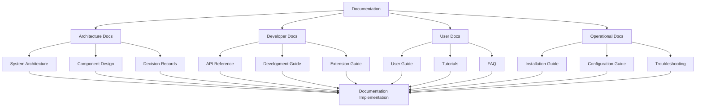

# Action Plan for Autonomous AI Agent Creator System - Part 2

## Table of Contents for Part 2

5. [User Interface & Experience](#5-user-interface--experience)
6. [Documentation & Knowledge Transfer](#6-documentation--knowledge-transfer)
7. [Continuous Improvement System](#7-continuous-improvement-system)
8. [Critical Analysis of Architectural Approaches](#8-critical-analysis-of-architectural-approaches)

## 5. User Interface & Experience

### 5.1 Streamlit Interface

#### 5.1.1 User Interface Design
- **Objective**: Create an intuitive, responsive interface
- **Tasks**:
  - Design user interface wireframes
  - Implement responsive layouts
  - Create consistent navigation patterns
  - Develop interactive components
  - Build accessibility features
  - Design user feedback mechanisms

#### 5.1.2 User Experience Optimization
- **Objective**: Ensure excellent user experience
- **Tasks**:
  - Implement progressive disclosure for complex features
  - Create guided workflows for common tasks
  - Develop contextual help and documentation
  - Build performance optimization for UI
  - Design error handling and recovery
  - Create user preference management

### 5.2 Knowledge Management Interface

#### 5.2.1 Source Management
- **Objective**: Enable easy management of knowledge sources
- **Tasks**:
  - Design source addition interface
  - Implement source configuration options
  - Create source validation and testing
  - Develop source monitoring dashboard
  - Build source update mechanisms
  - Design source removal and archiving

#### 5.2.2 Knowledge Exploration
- **Objective**: Provide visibility into processed knowledge
- **Tasks**:
  - Design knowledge browsing interface
  - Implement search and filtering
  - Create knowledge visualization tools
  - Develop relationship exploration
  - Build knowledge quality assessment
  - Design knowledge editing capabilities

### 5.3 Agent Management Interface

#### 5.3.1 Agent Creation & Configuration
- **Objective**: Simplify agent creation and management
- **Tasks**:
  - Design agent creation wizard
  - Implement template selection interface
  - Create configuration editor
  - Develop capability management
  - Build testing interface
  - Design deployment controls

#### 5.3.2 Agent Monitoring & Improvement
- **Objective**: Enable oversight and improvement of agents
- **Tasks**:
  - Design agent performance dashboard
  - Implement interaction monitoring
  - Create improvement suggestion interface
  - Develop version management
  - Build A/B testing controls
  - Design agent comparison tools

## 6. Documentation & Knowledge Transfer

### 6.1 Comprehensive Documentation

#### 6.1.1 Technical Documentation
- **Objective**: Provide comprehensive technical documentation
- **Tasks**:
  - Create architecture documentation
  - Develop component design documents
  - Write API references
  - Build developer guides
  - Design extension and plugin documentation
  - Create decision records with rationales

#### 6.1.2 User Documentation
- **Objective**: Enable users to effectively use the system
- **Tasks**:
  - Create user guides for different roles
  - Develop step-by-step tutorials
  - Write frequently asked questions
  - Build troubleshooting guides
  - Design best practice recommendations
  - Create example use cases

### 6.2 Knowledge Transfer System

#### 6.2.1 Developer Onboarding
- **Objective**: Enable new developers to quickly become productive
- **Tasks**:
  - Design developer onboarding process
  - Create development environment setup guides
  - Develop code walkthrough documentation
  - Build contribution guidelines
  - Design mentorship program
  - Create learning resources

#### 6.2.2 User Training
- **Objective**: Enable users to effectively use the system
- **Tasks**:
  - Design user training program
  - Create training materials
  - Develop interactive tutorials
  - Build certification process
  - Design knowledge assessment
  - Create community support resources

### 6.3 Documentation Automation

#### 6.3.1 Automated Documentation Generation
- **Objective**: Ensure documentation stays current with code
- **Tasks**:
  - Design documentation generation system
  - Implement code documentation extraction
  - Create API documentation generation
  - Develop diagram generation
  - Build documentation testing
  - Design documentation deployment

#### 6.3.2 Documentation Maintenance
- **Objective**: Keep documentation accurate and useful
- **Tasks**:
  - Design documentation review process
  - Implement documentation analytics
  - Create feedback collection
  - Develop documentation versioning
  - Build documentation search optimization
  - Design documentation localization

## 7. Continuous Improvement System

### 7.1 Feedback & Improvement Loop

#### 7.1.1 Feedback System
- **Objective**: Collect and analyze feedback for improvements
- **Tasks**:
  - Implement user feedback collection
  - Create system metrics gathering
  - Develop error reporting and analysis
  - Build feedback categorization
  - Design feedback prioritization
  - Create feedback response tracking

#### 7.1.2 Continuous Improvement Process
- **Objective**: Systematically improve the system
- **Tasks**:
  - Design improvement planning process
  - Implement solution design and validation
  - Create improvement implementation pipeline
  - Develop testing and verification
  - Build deployment and monitoring
  - Design impact assessment

### 7.2 Performance Monitoring & Optimization

#### 7.2.1 System Monitoring
- **Objective**: Maintain visibility into system performance
- **Tasks**:
  - Design monitoring dashboard
  - Implement resource utilization tracking
  - Create performance metrics collection
  - Develop alerting system
  - Build trend analysis
  - Design predictive monitoring

#### 7.2.2 Performance Optimization
- **Objective**: Continuously improve system performance
- **Tasks**:
  - Design performance optimization process
  - Implement bottleneck identification
  - Create optimization strategies
  - Develop A/B testing framework
  - Build performance regression testing
  - Design automated optimization

### 7.3 Knowledge & Agent Improvement

#### 7.3.1 Knowledge Quality Improvement
- **Objective**: Continuously improve knowledge quality
- **Tasks**:
  - Design knowledge quality metrics
  - Implement knowledge gap detection
  - Create knowledge conflict resolution
  - Develop knowledge refresh strategies
  - Build knowledge expansion planning
  - Design knowledge quality reporting

#### 7.3.2 Agent Capability Improvement
- **Objective**: Continuously enhance agent capabilities
- **Tasks**:
  - Design agent capability assessment
  - Implement capability gap analysis
  - Create capability enhancement planning
  - Develop capability testing framework
  - Build capability deployment pipeline
  - Design capability impact measurement

## 8. Critical Analysis of Architectural Approaches

### 8.1 Centralized Orchestration

**Pros:**
- Simpler coordination and control
- Easier to maintain consistency
- Clearer responsibility boundaries
- Simplified monitoring and debugging

**Cons:**
- Single point of failure
- Potential bottleneck for scaling
- Higher coupling between components
- Less flexibility for specialized agents

### 8.2 Distributed Collaboration

**Pros:**
- Higher resilience to failures
- Better horizontal scaling
- More autonomy for specialized agents
- Reduced central bottlenecks

**Cons:**
- More complex coordination
- Harder to maintain consistency
- More challenging to debug
- Potential for conflicting decisions

### 8.3 Hybrid Approach (Recommended)

**Pros:**
- Balances control and autonomy
- Flexible scaling options
- Domain-specific optimization
- Resilience with coordination

**Cons:**
- More complex initial design
- Requires clear boundary definitions
- Needs careful interface design
- More sophisticated testing required

### 8.4 Recommendation

Based on requirements for scalability, maintainability, and adaptability, we recommend a **Hybrid Architecture** with the following characteristics:

1. **Lightweight Orchestrator**: Handles high-level coordination, resource allocation, and system-wide decisions
2. **Domain-Specific Autonomy**: Specialized agents have autonomy within their domains
3. **Clear Interface Contracts**: Well-defined interfaces between all components
4. **Event-Driven Communication**: Asynchronous communication for scalability
5. **Plugin Architecture**: Extensibility through well-defined extension points
6. **Configuration-Driven Behavior**: Minimize hard coding through comprehensive configuration
7. **Framework Abstraction**: Isolate framework dependencies for easy updates and replacements

This approach provides the best balance of scalability, maintainability, and adaptability while supporting both local and cloud deployment options.

### 8.5 Implementation Considerations for Key Requirements

#### 8.5.1 Scalability Considerations
- Component-based architecture with clear boundaries
- Stateless design where possible
- Horizontal scaling through containerization
- Asynchronous processing for resource-intensive tasks
- Caching strategies for frequently accessed data
- Database sharding for large knowledge stores

#### 8.5.2 Modularity Considerations
- Interface-driven design
- Dependency injection for component coupling
- Event-based communication between components
- Plugin architecture for extensions
- Version-compatible interfaces
- Feature flags for optional capabilities

#### 8.5.3 Autonomy Considerations
- Capability-based agent design
- Self-monitoring and self-healing mechanisms
- Adaptive resource management
- Learning from feedback
- Configurable decision thresholds
- Graceful degradation under resource constraints

#### 8.5.4 Future-Proofing Considerations
- Framework abstraction layers
- Configuration-driven behavior
- Comprehensive testing at all levels
- Semantic versioning for all components
- Migration utilities for data and configuration
- Comprehensive documentation