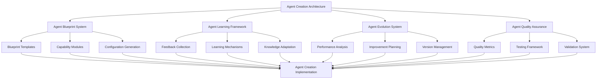
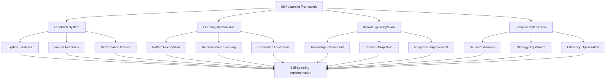
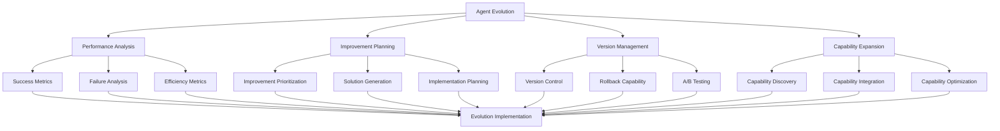
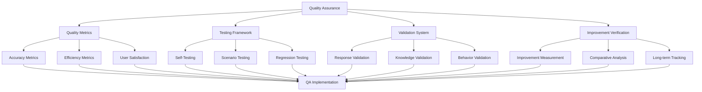
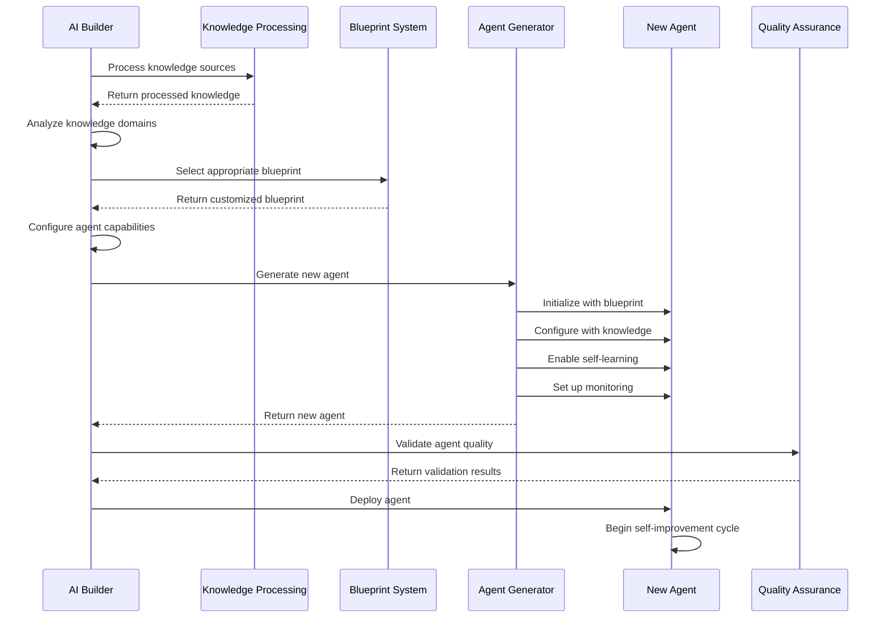
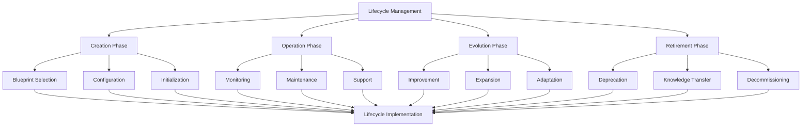

# Action Plan for Autonomous AI Agent Creator System - Part 3

## Table of Contents for Part 3

9. [Agent Creation & Self-Improvement Architecture](#9-agent-creation--self-improvement-architecture)
10. [Implementation Principles for Created Agents](#10-implementation-principles-for-created-agents)
11. [Key Differentiators of the Agent Creation System](#11-key-differentiators-of-the-agent-creation-system)
12. [Implementation Roadmap for Agent Creation System](#12-implementation-roadmap-for-agent-creation-system)

## 9. Agent Creation & Self-Improvement Architecture

### 9.1 Agent Blueprint System

#### 9.1.1 Modular Agent Architecture
- **Objective**: Create a flexible, modular architecture for all generated agents
- **Tasks**:
  - Design core agent blueprint with essential components
  - Create capability module system for agent specialization
  - Implement configuration-driven behavior for minimal hard coding
  - Develop interface contracts for all agent components
  - Design plugin architecture for agent extensions
  - Create framework abstraction layer for agent components

#### 9.1.2 Agent Capability Inheritance
- **Objective**: Ensure created agents inherit core system principles
- **Tasks**:
  - Implement scalability patterns in agent blueprints
  - Create resource self-management capabilities
  - Develop autonomous decision-making framework
  - Build adaptive configuration system
  - Design dependency management inheritance
  - Create update mechanism inheritance

#### 9.1.3 Agent Specialization System
- **Objective**: Enable effective specialization while maintaining core principles
- **Tasks**:
  - Design knowledge-based Q&A specialization modules
  - Create workflow automation specialization modules
  - Implement hybrid capability composition
  - Develop domain-specific optimization
  - Build specialized tool integration
  - Create specialized metrics and monitoring

### 9.2 Agent Self-Learning Framework

#### 9.2.1 Autonomous Feedback Collection
- **Objective**: Enable agents to collect and process feedback independently
- **Tasks**:
  - Design explicit feedback collection mechanisms
  - Implement implicit feedback analysis
  - Create performance metric self-monitoring
  - Develop interaction pattern analysis
  - Build user satisfaction detection
  - Design feedback categorization and prioritization

#### 9.2.2 Self-Learning Mechanisms
- **Objective**: Enable agents to learn and improve from experience
- **Tasks**:
  - Implement pattern recognition for common queries/tasks
  - Create reinforcement learning for response optimization
  - Develop knowledge gap identification
  - Build context adaptation mechanisms
  - Design response improvement strategies
  - Create learning rate optimization

#### 9.2.3 Knowledge Base Self-Management
- **Objective**: Enable agents to manage and improve their knowledge
- **Tasks**:
  - Implement knowledge validation mechanisms
  - Create knowledge conflict resolution
  - Develop knowledge expansion strategies
  - Build knowledge relevance assessment
  - Design knowledge refresh mechanisms
  - Create knowledge organization optimization

### 9.3 Agent Evolution System

#### 9.3.1 Autonomous Performance Analysis
- **Objective**: Enable agents to analyze their own performance
- **Tasks**:
  - Implement success metric tracking
  - Create failure analysis mechanisms
  - Develop efficiency measurement
  - Build resource utilization analysis
  - Design user satisfaction assessment
  - Create comparative performance analysis

#### 9.3.2 Self-Directed Improvement
- **Objective**: Enable agents to plan and implement their own improvements
- **Tasks**:
  - Implement improvement opportunity identification
  - Create improvement prioritization logic
  - Develop solution generation mechanisms
  - Build implementation planning
  - Design risk assessment for changes
  - Create improvement validation

#### 9.3.3 Safe Evolution Mechanisms
- **Objective**: Ensure agent evolution maintains stability and quality
- **Tasks**:
  - Implement version control for agent configurations
  - Create rollback capabilities for failed improvements
  - Develop A/B testing for improvements
  - Build gradual deployment strategies
  - Design improvement impact measurement
  - Create stability monitoring during changes

### 9.4 Agent Quality Assurance System

#### 9.4.1 Self-Testing Capabilities
- **Objective**: Enable agents to test their own functionality
- **Tasks**:
  - Implement self-diagnostic routines
  - Create scenario-based self-testing
  - Develop regression testing after changes
  - Build performance benchmark testing
  - Design edge case identification
  - Create test result analysis

#### 9.4.2 Response Validation System
- **Objective**: Ensure high-quality agent responses
- **Tasks**:
  - Implement accuracy validation mechanisms
  - Create relevance assessment
  - Develop completeness checking
  - Build consistency validation
  - Design clarity evaluation
  - Create helpfulness measurement

### 9.5 Agent Creation Workflow

#### 9.5.1 Knowledge-Based Q&A Agent Creation
- **Objective**: Streamline creation of effective knowledge agents
- **Tasks**:
  - Design knowledge processing for Q&A optimization
  - Implement question understanding capabilities
  - Create context-aware response generation
  - Develop knowledge retrieval optimization
  - Build clarification request mechanisms
  - Design explanation generation capabilities

#### 9.5.2 Workflow Automation Agent Creation
- **Objective**: Streamline creation of effective automation agents
- **Tasks**:
  - Design workflow analysis and modeling
  - Implement task sequencing capabilities
  - Create error handling and recovery
  - Develop resource management for workflows
  - Build progress tracking and reporting
  - Design workflow optimization capabilities

#### 9.5.3 Hybrid Agent Creation
- **Objective**: Enable creation of agents with mixed capabilities
- **Tasks**:
  - Design capability composition framework
  - Implement context switching mechanisms
  - Create integrated knowledge and workflow handling
  - Develop balanced resource allocation
  - Build unified interaction models
  - Design specialized hybrid templates

### 9.6 Agent Lifecycle Management

#### 9.6.1 Agent Lifecycle Automation
- **Objective**: Automate the complete agent lifecycle
- **Tasks**:
  - Implement agent creation workflow
  - Create operational monitoring
  - Develop evolution tracking
  - Build version management
  - Design retirement planning
  - Create knowledge preservation

#### 9.6.2 Agent Governance System
- **Objective**: Ensure proper oversight of autonomous agents
- **Tasks**:
  - Implement performance standards
  - Create ethical guidelines enforcement
  - Develop intervention triggers
  - Build audit logging
  - Design governance reporting
  - Create compliance verification

## 10. Implementation Principles for Created Agents

### 10.1 Scalability Inheritance

Created agents will inherit the following scalability principles:

1. **Resource Self-Management**: Agents monitor and manage their own resource usage
2. **Adaptive Processing**: Adjust processing depth based on available resources
3. **Incremental Knowledge Handling**: Process knowledge in manageable chunks
4. **Asynchronous Operations**: Use non-blocking operations for resource-intensive tasks
5. **Caching Strategies**: Implement intelligent caching for frequent operations
6. **Load Shedding**: Gracefully handle overload situations

### 10.2 Modularity Inheritance

Created agents will inherit the following modularity principles:

1. **Component-Based Architecture**: Built from interchangeable components
2. **Interface-Driven Design**: All components interact through well-defined interfaces
3. **Capability Registration**: Dynamically register and discover capabilities
4. **Configuration-Driven Behavior**: Minimize hard coding through configuration
5. **Extension Points**: Pre-defined points for adding new functionality
6. **Dependency Injection**: Loose coupling between components

### 10.3 Autonomy Inheritance

Created agents will inherit the following autonomy principles:

1. **Self-Monitoring**: Monitor own performance and health
2. **Self-Healing**: Recover from errors and failures
3. **Self-Optimization**: Improve performance based on usage patterns
4. **Self-Configuration**: Adjust configuration based on environment
5. **Self-Protection**: Implement safeguards against misuse
6. **Self-Knowledge**: Maintain awareness of own capabilities and limitations

### 10.4 Future-Proofing Inheritance

Created agents will inherit the following future-proofing principles:

1. **Framework Abstraction**: Isolate framework dependencies
2. **Versioned Interfaces**: Maintain compatibility across versions
3. **Feature Flags**: Enable/disable features without code changes
4. **Migration Utilities**: Smooth transitions between versions
5. **Backward Compatibility**: Support for legacy operations
6. **Forward Compatibility**: Preparation for upcoming features

## 11. Key Differentiators of the Agent Creation System

### 11.1 Self-Improvement Focus

Unlike traditional agent creation systems that produce static agents, this system creates agents that:

1. **Learn Continuously**: Improve from every interaction
2. **Evolve Autonomously**: Identify and implement their own improvements
3. **Adapt to Changing Needs**: Modify behavior based on usage patterns
4. **Optimize Their Knowledge**: Refine and expand their knowledge base
5. **Enhance Their Capabilities**: Discover and integrate new capabilities
6. **Measure Their Progress**: Track improvement over time

### 11.2 Principle Inheritance

The system ensures that created agents inherit the core principles of the AI Builder:

1. **Architectural Patterns**: Same patterns for scalability and modularity
2. **Quality Standards**: Same standards for accuracy and performance
3. **Autonomy Mechanisms**: Same mechanisms for self-improvement
4. **Configuration Approach**: Same approach to minimize hard coding
5. **Update Mechanisms**: Same mechanisms for handling updates
6. **Extension Capabilities**: Same capabilities for future enhancements

### 11.3 Balanced Workload Distribution

The system ensures that created agents maintain high quality through:

1. **Task Complexity Analysis**: Assess complexity before assignment
2. **Resource Requirement Estimation**: Estimate resources needed
3. **Capability Matching**: Match tasks to agent capabilities
4. **Workload Monitoring**: Track agent workload in real-time
5. **Dynamic Task Adjustment**: Adjust tasks based on performance
6. **Quality-Workload Balancing**: Optimize for both quality and efficiency

## 12. Implementation Roadmap for Agent Creation System

### 12.1 Phase 1: Foundation

1. Design agent blueprint architecture
2. Implement basic feedback collection
3. Create core self-testing capabilities
4. Develop initial knowledge-based agent template
5. Build initial workflow automation agent template

### 12.2 Phase 2: Self-Improvement

1. Implement pattern recognition for learning
2. Create knowledge adaptation mechanisms
3. Develop performance self-analysis
4. Build improvement planning capabilities
5. Create safe evolution mechanisms

### 12.3 Phase 3: Advanced Capabilities

1. Implement hybrid agent templates
2. Create advanced self-testing scenarios
3. Develop sophisticated learning algorithms
4. Build comprehensive quality metrics
5. Create advanced lifecycle management

### 12.4 Phase 4: Optimization & Refinement

1. Optimize resource utilization
2. Refine learning mechanisms
3. Enhance quality assurance
4. Improve lifecycle automation
5. Expand template library