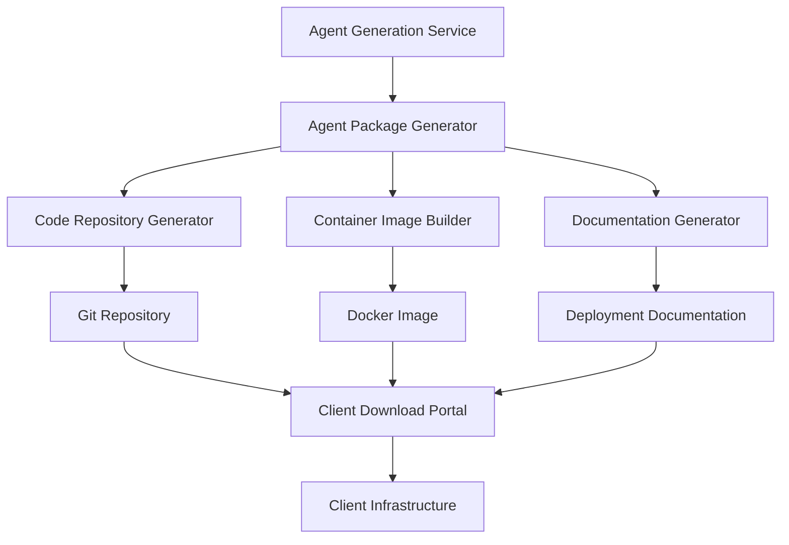

# Client Ownership Model Implementation Plan

This document outlines the specific modifications needed to incorporate the client ownership model across all components of the Autonomous AI Agent Creator System. The client ownership model establishes that AI agents built specifically for a client's company are the client's property, not the service provider's, while still providing hosting and fully managed options.

## 1. Foundation Layer Design Modifications

### 1.1 Update to Section 10 (Intellectual Property and Data Separation)

In `foundation_layer_design.md`, modify section 10.1 to explicitly state:

```markdown
### 10.1 IP Protection Architecture with Client Ownership Model

#### 10.1.0 Client Ownership Principles
- **Client-Generated Agents**: All AI agents generated specifically for a client are the client's intellectual property
- **Client Data Ownership**: All client-specific knowledge, configurations, and data remain the client's property
- **System IP Boundaries**: The builder system, core algorithms, and generation capabilities remain the service provider's IP
- **Exportable Architecture**: All generated agents must be designed to be fully exportable and self-contained

#### 10.1.1 Code and Data Separation
- **Core IP in Foundation Layer**: Intellectual property of the service provider resides in the code, not the data
- **Client Data Isolation**: Complete isolation of client data in separate storage
- **Knowledge Processing Boundaries**: Clear separation between processing logic and processed data
- **Stateless Processing**: Process client data without persisting it in the core system
- **Agent Ownership Boundaries**: Clear delineation between system components and client-owned agents

#### 10.1.2 Deployment Models Supporting Client Ownership
- **SaaS Model**: Core IP remains on service provider infrastructure, clients access via APIs
- **On-Premise Deployment**: Deploy compiled/obfuscated system code to client infrastructure
- **Hybrid Deployment**: Critical IP components in SaaS, data processing on client infrastructure
- **Container Deployment**: Encapsulated system with access controls and usage monitoring
- **Agent Export**: Standardized formats for exporting client-owned agents (Docker, code repositories)
```

### 1.2 Add New Section on Agent Export Capabilities

Add a new section to `foundation_layer_design.md`:

```markdown
### 11. Agent Export and Client Ownership Implementation

#### 11.1 Agent Export Architecture



#### 11.2 Export Formats and Standards
- **Code Repository**: Complete source code with dependency management
- **Container Images**: Ready-to-deploy Docker containers
- **Serverless Packages**: AWS Lambda/Azure Functions compatible packages
- **Documentation**: Auto-generated deployment and maintenance guides

#### 11.3 Client Download Portal
- **Authentication**: Secure access to client-owned agents
- **Version Control**: Access to all versions of generated agents
- **Deployment Options**: One-click deployment to common platforms
- **Documentation**: Comprehensive guides for self-hosting

#### 11.4 Update Mechanisms for Exported Agents
- **Version Checking**: Mechanism to check for system updates
- **Patch Application**: Secure method to apply patches to exported agents
- **Configuration Updates**: Method to update agent configurations
- **Knowledge Refresh**: Process to update agent knowledge bases
```

## 2. Component-Specific Modifications

### 2.1 Agent Framework (Foundation Layer)

In `implementation/01_foundation_layer/src/agent_framework/base_agent.py`, add ownership metadata:

```python
class BaseAgent:
    def __init__(self, config):
        self.config = config
        self.ownership_metadata = {
            "owner": config.get("owner", "system"),
            "exportable": config.get("exportable", True),
            "export_formats": config.get("export_formats", ["repository", "container"])
        }
    
    # Add new method
    def get_ownership_info(self):
        return self.ownership_metadata
        
    # Add new method
    def prepare_for_export(self, export_format):
        """
        Prepare the agent for export in the specified format
        
        Args:
            export_format: Format to export the agent in ("repository", "container", etc.)
            
        Returns:
            Dictionary with export preparation information
        """
        pass
```

### 2.2 Agent Generation Service

In the Agent Generation Service plan (`9_Independent_Components.md`, Document 4), add a new section:

```markdown
2.5 Agent Export System:
◦ Enable exporting of generated agents for client ownership.
◦ Implement repository generation for complete agent source code.
◦ Create container image building for deployable agent packages.
◦ Develop comprehensive documentation generation for deployment and maintenance.
◦ Build client download portal integration for secure access to exported agents.
```

### 2.3 Deployment Abstraction Layer

In `implementation/01_foundation_layer/src/deployment/resource_abstraction.py`, add export capabilities:

```python
class ResourceAbstraction:
    # Add new method
    def prepare_export_package(self, agent_id, export_format):
        """
        Prepare an export package for an agent
        
        Args:
            agent_id: ID of the agent to export
            export_format: Format to export the agent in
            
        Returns:
            Path to the export package
        """
        pass
    
    # Add new method
    def generate_deployment_instructions(self, agent_id, target_environment):
        """
        Generate deployment instructions for an exported agent
        
        Args:
            agent_id: ID of the agent
            target_environment: Target environment for deployment
            
        Returns:
            Deployment instructions as markdown
        """
        pass
```

### 2.4 Component Registry

In `implementation/01_foundation_layer/src/architecture/component_registry.py`, add ownership tracking:

```python
class ComponentRegistry:
    # Add new method
    def register_client_owned_component(self, component, client_id):
        """
        Register a component as owned by a specific client
        
        Args:
            component: The component to register
            client_id: ID of the client who owns the component
        """
        pass
    
    # Add new method
    def get_client_components(self, client_id):
        """
        Get all components owned by a specific client
        
        Args:
            client_id: ID of the client
            
        Returns:
            List of components owned by the client
        """
        pass
```

## 3. New Components to Implement

### 3.1 Client Download Portal

Create a new component plan in `9_Independent_Components.md`:

```markdown
--------------------------------------------------------------------------------
Document 10: Plan for Client Download Portal
Overview: This document outlines the plan for developing the Client Download Portal, which provides clients with secure access to their generated AI agents, enabling them to download, deploy, and manage their agents independently.
Objective: To create a secure, user-friendly portal that enables clients to access, download, and manage their AI agents, supporting the client ownership model while maintaining a strong relationship with the service provider.
Development Plan Details:
1.
Portal Interface Development:
◦
User Authentication & Authorization:
▪
Implement secure authentication for client access.
▪
Create role-based access control for different user types.
▪
Develop client organization management for enterprise clients.
▪
Build secure API keys management for programmatic access.
◦
Agent Repository Interface:
▪
Create a dashboard showing all client-owned agents.
▪
Implement version history and change tracking.
▪
Develop filtering and search capabilities.
▪
Build comparison tools for different agent versions.
2.
Export Format Implementation:
◦
Code Repository Generation:
▪
Implement Git repository generation with complete source code.
▪
Create dependency management configuration.
▪
Develop build scripts and instructions.
▪
Build test suites for exported agents.
◦
Container Image Building:
▪
Create Docker image generation for agents.
▪
Implement multi-platform container support.
▪
Develop container configuration options.
▪
Build container orchestration templates.
3.
Deployment Assistance:
◦
Documentation Generation:
▪
Create automated deployment documentation.
▪
Implement environment-specific instructions.
▪
Develop troubleshooting guides.
▪
Build maintenance procedure documentation.
◦
Deployment Automation:
▪
Create one-click deployment to common cloud platforms.
▪
Implement local deployment scripts.
▪
Develop environment validation tools.
▪
Build post-deployment verification.
4.
Update & Maintenance Support:
◦
Update Notification System:
▪
Implement notification for system updates relevant to exported agents.
▪
Create security patch alerts.
▪
Develop compatibility checking for updates.
▪
Build update impact assessment tools.
◦
Remote Maintenance Options:
▪
Create opt-in remote monitoring capabilities.
▪
Implement diagnostic tools for exported agents.
▪
Develop remote update application (with client approval).
▪
Build performance optimization recommendations.
5.
Integration with other Services:
◦
Ensure seamless interaction with the Agent Generation Service, Agent Execution & Monitoring Service, and Foundation Layer.
```

### 3.2 Agent Export Service

Create a new component implementation plan:

```markdown
--------------------------------------------------------------------------------
Document 11: Plan for Agent Export Service
Overview: This document outlines the plan for developing the Agent Export Service, which is responsible for packaging, exporting, and preparing client-owned agents for deployment in various environments.
Objective: To create a robust system for transforming generated agents into self-contained, deployable packages that clients can download and run independently, while maintaining quality and providing update paths.
Development Plan Details:
1.
Export Format Development:
◦
Source Code Repository:
▪
Implement complete source code extraction and organization.
▪
Create dependency management configuration generation.
▪
Develop build system configuration.
▪
Build test suite packaging.
◦
Container Image:
▪
Create Docker image generation with all dependencies.
▪
Implement multi-stage build optimization.
▪
Develop security hardening for containers.
▪
Build container configuration options.
◦
Serverless Package:
▪
Implement AWS Lambda compatible packaging.
▪
Create Azure Functions compatible packaging.
▪
Develop other serverless platform support.
▪
Build serverless configuration generation.
2.
Documentation Generation:
◦
Deployment Documentation:
▪
Create environment-specific deployment guides.
▪
Implement requirement documentation.
▪
Develop configuration option documentation.
▪
Build troubleshooting guides.
◦
Maintenance Documentation:
▪
Create update procedure documentation.
▪
Implement monitoring setup guides.
▪
Develop backup and recovery procedures.
▪
Build performance tuning guides.
3.
Update Mechanism Implementation:
◦
Version Tracking:
▪
Implement version tracking for exported agents.
▪
Create compatibility matrix maintenance.
▪
Develop update path determination.
▪
Build update notification system.
◦
Update Packages:
▪
Create delta update package generation.
▪
Implement full update package generation.
▪
Develop update verification tools.
▪
Build rollback package generation.
4.
Security Implementation:
◦
Export Security:
▪
Implement secure packaging of sensitive configurations.
▪
Create credential management for exported agents.
▪
Develop security scanning of exported packages.
▪
Build security documentation generation.
◦
Update Security:
▪
Create secure update delivery mechanism.
▪
Implement update package signing.
▪
Develop update verification.
▪
Build secure update application process.
5.
Integration with other Services:
◦
Ensure seamless interaction with the Agent Generation Service, Client Download Portal, and Foundation Layer.
```

## 4. Implementation Timeline

1. **Phase 1: Foundation Updates (Weeks 1-2)**
   - Update Foundation Layer design document with client ownership model
   - Modify BaseAgent class to include ownership metadata
   - Update Component Registry to track ownership

2. **Phase 2: Export Capability Development (Weeks 3-5)**
   - Implement agent export formats (repository, container)
   - Develop deployment abstraction layer export capabilities
   - Create documentation generation system

3. **Phase 3: Portal Development (Weeks 6-8)**
   - Implement Client Download Portal
   - Create secure authentication and authorization
   - Develop agent repository interface

4. **Phase 4: Update Mechanism (Weeks 9-10)**
   - Implement version tracking for exported agents
   - Develop update package generation
   - Create update notification system

5. **Phase 5: Integration & Testing (Weeks 11-12)**
   - Integrate all components with client ownership model
   - Test export and deployment workflows
   - Validate update mechanisms

## 5. Business Model Considerations

The client ownership model requires adjustments to the business model:

1. **Value-Added Services**
   - Hosting and management services for clients who prefer not to self-host
   - Maintenance and update services for exported agents
   - Integration services with client systems
   - Training and support services

2. **Tiered Pricing Model**
   - Base tier: Agent generation and export capabilities
   - Standard tier: Adds hosting, basic updates, and support
   - Premium tier: Adds advanced monitoring, priority updates, and dedicated support

3. **Update Subscription**
   - Ongoing access to system improvements and updates
   - Security patches and vulnerability fixes
   - Knowledge base refreshes and improvements

4. **Custom Development**
   - Custom agent development services
   - Specialized integration work
   - Performance optimization services

This approach balances client ownership with sustainable revenue generation, focusing on ongoing value delivery rather than IP ownership.