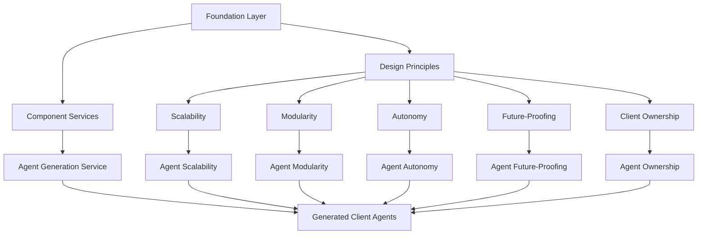

# Design Principles Inheritance for Client Agents

## Overview

This document focuses specifically on how design principles are inherited by the AI agents built for clients. It outlines the inheritance path from the Foundation Layer through all components to the generated agents, ensuring that client-owned agents maintain the same high standards and capabilities as system agents while respecting client ownership.

## Inheritance Path



## Design Principles Inheritance Mechanism

### 1. Foundation Layer to Component Services

The Foundation Layer establishes the core design principles and provides the mechanisms for their inheritance:

- **Base Classes**: Components extend base classes that implement the core design principles
- **Interface Contracts**: Components implement interfaces that enforce the design principles
- **Configuration System**: Configuration settings enforce design principles across components
- **Component Registry**: Tracks and manages components with their design principles
- **Extension System**: Allows extending functionality while maintaining design principles

### 2. Component Services to Agent Generation Service

The Component Services inherit design principles from the Foundation Layer and extend them with domain-specific implementations:

- **Knowledge Processing Service**: Adds knowledge-specific scalability and modularity
- **Tool Management Service**: Adds tool-specific autonomy and future-proofing
- **Agent Execution Service**: Adds execution-specific scalability and autonomy
- **Self-Improvement Service**: Adds evolution-specific autonomy and future-proofing

### 3. Agent Generation Service to Generated Client Agents

The Agent Generation Service creates agents that inherit design principles from all previous layers:

- **Agent Blueprint System**: Templates that encode design principles
- **Agent Configuration**: Settings that enforce design principles
- **Agent Capabilities**: Functionality that implements design principles
- **Agent Lifecycle Management**: Processes that maintain design principles throughout the agent's life

## Specific Inheritance for Each Design Principle

### 1. Scalability Inheritance for Client Agents

Client agents inherit scalability through:

#### Code Level Inheritance
```python
class ClientAgent(BaseAgent):
    def __init__(self, config):
        super().__init__(config)
        self.resource_manager = ResourceManager(config.get('resource_limits'))
        
    def execute_task(self, task):
        # Check resource availability before execution
        if self.resource_manager.can_handle(task):
            # Execute with resource awareness
            return self._execute_with_resource_management(task)
        else:
            # Handle resource constraints gracefully
            return self._handle_resource_limitation(task)
```

#### Configuration Inheritance
```json
{
  "agent": {
    "resource_limits": {
      "memory": "512MB",
      "cpu": "0.5",
      "concurrent_tasks": 5,
      "auto_scale": true,
      "scale_threshold": 0.8
    },
    "scaling_strategy": "horizontal",
    "caching_enabled": true,
    "async_processing": true
  }
}
```

#### Behavioral Inheritance
- **Resource Self-Management**: Agents monitor and manage their own resource usage
- **Adaptive Processing**: Adjust processing depth based on available resources
- **Incremental Knowledge Handling**: Process knowledge in manageable chunks
- **Asynchronous Operations**: Use non-blocking operations for resource-intensive tasks
- **Caching Strategies**: Implement intelligent caching for frequent operations
- **Load Shedding**: Gracefully handle overload situations

### 2. Modularity Inheritance for Client Agents

Client agents inherit modularity through:

#### Code Level Inheritance
```python
class ClientAgent(BaseAgent):
    def __init__(self, config):
        super().__init__(config)
        self.capability_registry = CapabilityRegistry()
        
        # Register capabilities from configuration
        for capability_config in config.get('capabilities', []):
            self.capability_registry.register(
                Capability.from_config(capability_config)
            )
    
    def add_capability(self, capability):
        self.capability_registry.register(capability)
        
    def remove_capability(self, capability_id):
        self.capability_registry.unregister(capability_id)
        
    def execute_task(self, task):
        # Find appropriate capability for task
        capability = self.capability_registry.find_for_task(task)
        if capability:
            return capability.execute(task)
        return None
```

#### Configuration Inheritance
```json
{
  "agent": {
    "capabilities": [
      {
        "id": "knowledge_qa",
        "type": "question_answering",
        "config": {
          "knowledge_source": "client_knowledge_base",
          "response_format": "markdown"
        }
      },
      {
        "id": "workflow_automation",
        "type": "task_execution",
        "config": {
          "allowed_tools": ["email", "calendar", "documents"],
          "security_level": "client_controlled"
        }
      }
    ],
    "extension_points": [
      "pre_processing",
      "post_processing",
      "error_handling"
    ]
  }
}
```

#### Behavioral Inheritance
- **Component-Based Architecture**: Built from interchangeable components
- **Interface-Driven Design**: All components interact through well-defined interfaces
- **Capability Registration**: Dynamically register and discover capabilities
- **Configuration-Driven Behavior**: Minimize hard coding through configuration
- **Extension Points**: Pre-defined points for adding new functionality
- **Dependency Injection**: Loose coupling between components

### 3. Autonomy Inheritance for Client Agents

Client agents inherit autonomy through:

#### Code Level Inheritance
```python
class ClientAgent(BaseAgent):
    def __init__(self, config):
        super().__init__(config)
        self.health_monitor = HealthMonitor(self)
        self.learning_system = LearningSystem(config.get('learning_config'))
        self.adaptation_manager = AdaptationManager(config.get('adaptation_rules'))
        
        # Start self-monitoring
        self.health_monitor.start()
        
    def execute_task(self, task):
        try:
            result = super().execute_task(task)
            
            # Learn from execution
            self.learning_system.process_execution(task, result)
            
            # Adapt based on execution
            self.adaptation_manager.evaluate_and_adapt(task, result)
            
            return result
        except Exception as e:
            # Self-healing
            recovery_result = self.health_monitor.handle_error(e, task)
            
            # Learn from failure
            self.learning_system.process_failure(task, e)
            
            return recovery_result
```

#### Configuration Inheritance
```json
{
  "agent": {
    "learning_config": {
      "enabled": true,
      "learning_rate": 0.01,
      "feedback_sources": ["user_explicit", "task_success", "error_rate"],
      "knowledge_update_threshold": 0.7
    },
    "adaptation_rules": [
      {
        "metric": "error_rate",
        "threshold": 0.1,
        "action": "increase_verification"
      },
      {
        "metric": "response_time",
        "threshold": 2.0,
        "action": "enable_caching"
      }
    ],
    "self_healing": {
      "max_retries": 3,
      "fallback_strategies": ["simplify_task", "request_clarification"]
    }
  }
}
```

#### Behavioral Inheritance
- **Self-Monitoring**: Monitor own performance and health
- **Self-Healing**: Recover from errors and failures
- **Self-Optimization**: Improve performance based on usage patterns
- **Self-Configuration**: Adjust configuration based on environment
- **Self-Protection**: Implement safeguards against misuse
- **Self-Knowledge**: Maintain awareness of own capabilities and limitations

### 4. Future-Proofing Inheritance for Client Agents

Client agents inherit future-proofing through:

#### Code Level Inheritance
```python
class ClientAgent(BaseAgent):
    def __init__(self, config):
        super().__init__(config)
        self.framework_adapter = FrameworkAdapterFactory.create(
            config.get('framework', 'default')
        )
        self.version_manager = VersionManager(config.get('version_config'))
        
    def update(self, update_package):
        # Validate update compatibility
        if self.version_manager.is_compatible(update_package):
            # Apply update
            update_result = self.version_manager.apply_update(update_package)
            
            # Migrate configuration if needed
            if update_result.requires_config_migration:
                self.version_manager.migrate_configuration()
                
            return update_result
        return UpdateResult(success=False, reason="Incompatible update")
```

#### Configuration Inheritance
```json
{
  "agent": {
    "framework": "latest",
    "version_config": {
      "current_version": "1.0.0",
      "update_channel": "stable",
      "auto_update": false,
      "compatibility_check": true,
      "rollback_enabled": true
    },
    "feature_flags": {
      "new_embedding_model": false,
      "enhanced_reasoning": true,
      "experimental_tools": false
    }
  }
}
```

#### Behavioral Inheritance
- **Framework Abstraction**: Isolate framework dependencies
- **Versioned Interfaces**: Maintain compatibility across versions
- **Feature Flags**: Enable/disable features without code changes
- **Migration Utilities**: Smooth transitions between versions
- **Backward Compatibility**: Support for legacy operations
- **Forward Compatibility**: Preparation for upcoming features

### 5. Client Ownership Inheritance for Client Agents

Client agents inherit ownership principles through:

#### Code Level Inheritance
```python
class ClientAgent(BaseAgent):
    def __init__(self, config):
        super().__init__(config)
        self.owner_id = config.get('owner_id')
        self.ownership_type = config.get('ownership_type', 'client')
        self.exportable = config.get('exportable', True)
        self.export_manager = ExportManager(config.get('export_config'))
        
    def prepare_for_export(self, export_format='source'):
        """Prepare agent for export in the specified format"""
        return self.export_manager.prepare(self, export_format)
        
    def validate_ownership(self, operation):
        """Validate that an operation is allowed under ownership rules"""
        return self.owner_id is not None and operation in self.config.get('allowed_operations', [])
```

#### Configuration Inheritance
```json
{
  "agent": {
    "owner_id": "client-12345",
    "ownership_type": "client",
    "exportable": true,
    "export_config": {
      "formats": ["source", "container", "serverless"],
      "include_documentation": true,
      "include_tests": true,
      "obfuscate_sensitive_data": true
    },
    "allowed_operations": [
      "export",
      "update",
      "configure",
      "extend"
    ]
  }
}
```

#### Behavioral Inheritance
- **Ownership Metadata**: Maintain clear ownership information
- **Export Capability**: Support for exporting to different formats
- **IP Boundaries**: Respect intellectual property boundaries
- **Client Control**: Allow client control over agent behavior
- **Update Mechanism**: Support for updates while respecting ownership
- **Documentation Generation**: Generate client-specific documentation

## Implementation in Agent Generation Process

The Agent Generation Service ensures design principles inheritance through the following steps:

1. **Blueprint Selection**: Select a blueprint that implements all required design principles
2. **Configuration Generation**: Generate configuration that enforces design principles
3. **Capability Integration**: Add capabilities that implement design principles
4. **Ownership Assignment**: Set ownership metadata for the agent
5. **Export Preparation**: Configure export capabilities based on ownership
6. **Validation**: Verify that all design principles are properly implemented
7. **Documentation**: Generate documentation explaining the implemented design principles

## Client Control Over Inherited Principles

While design principles are inherited by default, clients have control over certain aspects:

1. **Scalability Control**: Clients can set resource limits and scaling strategies
2. **Modularity Control**: Clients can enable/disable capabilities and extension points
3. **Autonomy Control**: Clients can configure learning and adaptation parameters
4. **Future-Proofing Control**: Clients can manage update policies and feature flags
5. **Ownership Control**: Clients can set export preferences and allowed operations

## Testing and Verification

To ensure proper inheritance of design principles, the following tests are performed:

1. **Scalability Testing**: Verify that agents can handle increasing workloads
2. **Modularity Testing**: Verify that capabilities can be added/removed without issues
3. **Autonomy Testing**: Verify that agents can learn and adapt appropriately
4. **Future-Proofing Testing**: Verify that agents can be updated without breaking changes
5. **Ownership Testing**: Verify that ownership rules are respected in all operations

## Conclusion

By implementing this inheritance mechanism, we ensure that all AI agents built for clients maintain the same high standards and capabilities as system agents while respecting client ownership. This approach provides clients with powerful, flexible agents that can be deployed in their own environments while benefiting from the ongoing improvements to the underlying system.

The inheritance of design principles is not just a technical implementation but a core value proposition of our system, ensuring that client-owned agents are as capable, reliable, and future-proof as those managed directly by our system.