# Foundation Layer Design: Fully Managed Serverless Architecture

## 1. Overview

The Foundation Layer provides the core infrastructure and framework components upon which the entire Autonomous AI Agent Creator System is built. This layer establishes the fundamental principles of Scalability, Modularity, Autonomy, and Future-Proofing that guide the development of all other components.

This design document outlines a fully managed serverless architecture for the Foundation Layer, optimized for self-management, minimal maintenance, and operational efficiency.

## 2. Architectural Approach

### 2.1 Fully Managed Serverless Architecture

We will implement the Foundation Layer as a set of serverless components on AWS, providing a self-manageable infrastructure with minimal maintenance requirements:

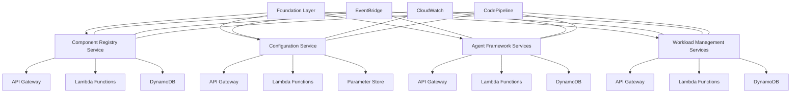

### 2.2 Key Architectural Decisions

1. **Serverless First**: All components implemented as serverless functions to minimize maintenance
2. **Event-Driven Communication**: Components communicate via events for loose coupling
3. **Managed State**: All state stored in managed services (DynamoDB, Parameter Store)
4. **API-Based Integration**: All components expose well-defined APIs
5. **Automated Operations**: CI/CD, monitoring, and remediation fully automated

## 3. Component Design

### 3.1 Component Registry Service

The Component Registry provides a central registry for all system components, enabling discovery and integration.

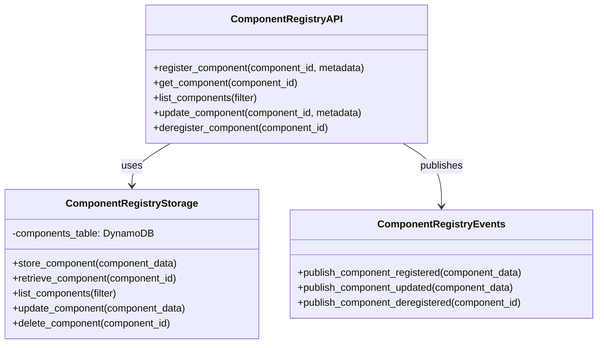

**AWS Implementation:**
- API Gateway for RESTful API
- Lambda functions for business logic
- DynamoDB for component storage
- EventBridge for event publishing

### 3.2 Configuration Service

The Configuration Service provides centralized configuration management with versioning and environment support.

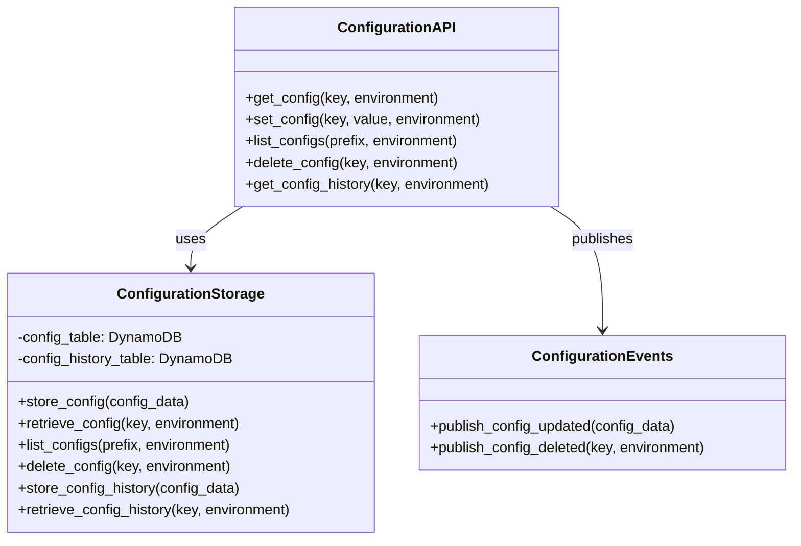

**AWS Implementation:**
- API Gateway for RESTful API
- Lambda functions for business logic
- DynamoDB for configuration storage
- Parameter Store for sensitive configurations
- EventBridge for configuration change events

### 3.3 Agent Framework Services

The Agent Framework provides the foundation for creating and managing agents.

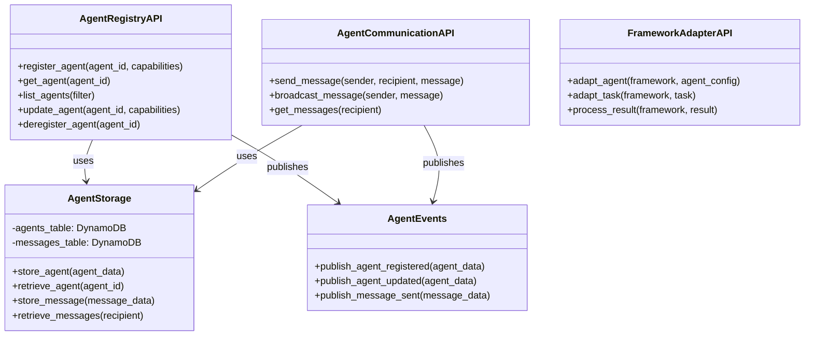

**AWS Implementation:**
- API Gateway for RESTful APIs
- Lambda functions for business logic
- DynamoDB for agent and message storage
- EventBridge for agent events
- SQS for message queuing

### 3.4 Workload Management Services

The Workload Management system distributes tasks, monitors resources, and ensures quality.

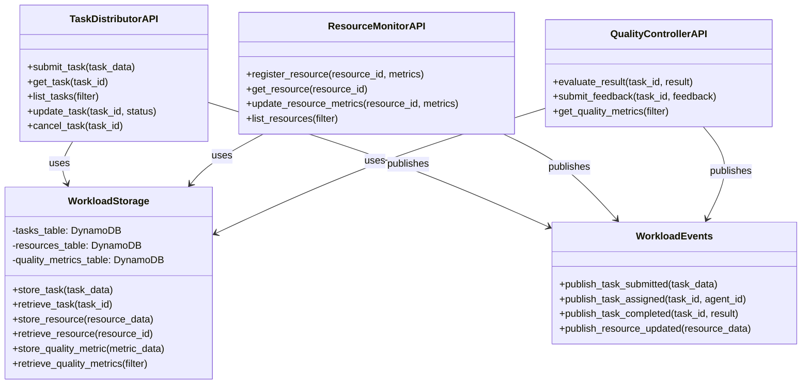

**AWS Implementation:**
- API Gateway for RESTful APIs
- Lambda functions for business logic
- DynamoDB for task, resource, and quality data
- EventBridge for workload events
- Step Functions for complex task workflows

## 4. Self-Management Capabilities

### 4.1 Automatic Updates

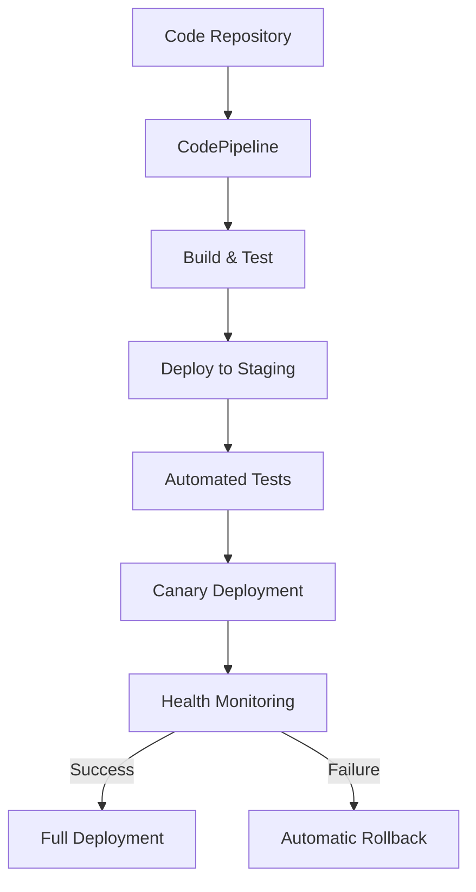

- **CI/CD Pipeline**: Fully automated pipeline for testing and deployment
- **Canary Deployments**: Gradual rollout of updates to detect issues early
- **Automated Testing**: Comprehensive test suite runs before deployment
- **Automatic Rollbacks**: Immediate rollback if issues detected

### 4.2 Self-Monitoring & Healing

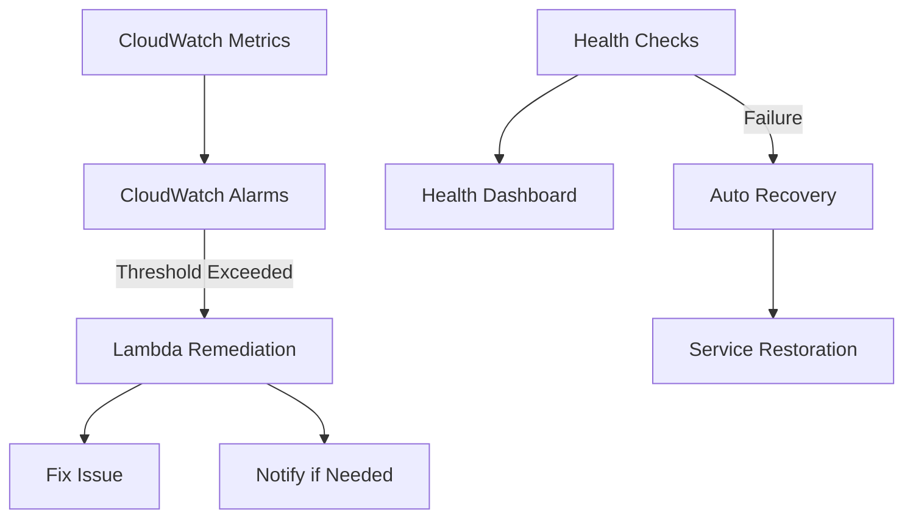

- **Comprehensive Monitoring**: All components emit detailed metrics
- **Automated Remediation**: Lambda functions respond to common issues
- **Health Checks**: Regular verification of system integrity
- **Anomaly Detection**: Machine learning to detect unusual patterns

### 4.3 Update Management System

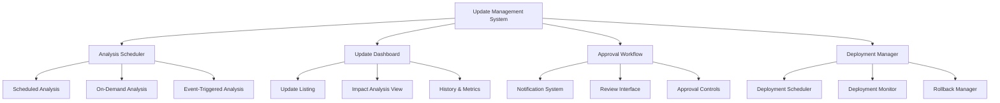

#### 4.3.1 Analysis Frequency Configuration

The system provides configurable analysis schedules:

- **Default Schedule**: Monthly comprehensive analysis (configurable)
- **Tiered Schedules**:
  - **Security Scans**: Weekly (Tier 1)
  - **Dependency Updates**: Bi-weekly (Tier 1 & 2)
  - **Performance Analysis**: Monthly (All Tiers)
- **Event-Based Triggers**:
  - Critical security vulnerabilities (immediate)
  - Major dependency releases (within 48 hours)
  - System performance degradation (based on thresholds)
- **Manual Triggers**:
  - On-demand analysis through admin interface

#### 4.3.2 Human Interaction Interface

The Update Management System provides a comprehensive web interface:

**1. Update Dashboard**
- **Main View**: 
  - Card-based layout showing pending updates by tier
  - Color-coded by urgency/impact (red for security, yellow for major updates, etc.)
  - Filterable by component, update type, and status
  - Sortable by date, impact, or confidence score

- **Update Detail View**:
  - Comprehensive change summary with AI-generated explanation
  - Before/after code comparisons with highlighted changes
  - Dependency graph showing affected components
  - Test results and compatibility analysis
  - Risk assessment with specific concerns highlighted

**2. Approval Workflow**
- **Notification Center**:
  - Email/Slack integration for alerts
  - In-app notification system
  - Configurable notification preferences by update tier and type

- **Review Interface**:
  - Side-by-side comparison of versions
  - Inline commenting on specific changes
  - Approval checklist with required verification steps
  - Deployment scheduling options (immediate, scheduled, maintenance window)

**3. Monitoring & Control**
- **Deployment Progress**:
  - Real-time progress indicators
  - Stage-by-stage deployment tracking
  - Traffic shifting visualization for canary deployments

- **Performance Metrics**:
  - Before/after comparisons of key metrics
  - Anomaly detection with automatic highlighting
  - User-defined thresholds for automatic rollbacks

**4. History & Reporting**
- **Update History**:
  - Timeline of all updates with filtering options
  - Success/failure statistics
  - Mean time between updates by component
  - Correlation between updates and system incidents

- **Compliance Reporting**:
  - Audit logs of all approval actions
  - Security vulnerability remediation tracking
  - Compliance status for regulatory requirements

#### 4.3.3 Technical Implementation

The Update Management System is implemented as:

- **Frontend**: React-based SPA with responsive design
- **Backend**: Serverless API using Lambda and API Gateway
- **Storage**: DynamoDB for update metadata and status
- **Authentication**: Integration with AWS Cognito or existing auth system
- **Notifications**: SNS for email/Slack integration
- **Deployment**: CloudFormation templates for easy setup

### 4.4 Automatic Scaling

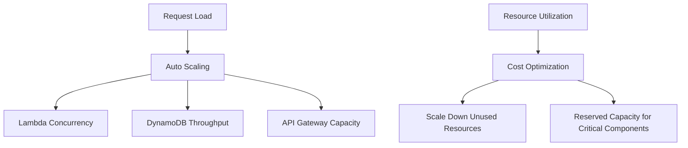

- **Serverless Scaling**: Automatic scaling based on demand
- **DynamoDB Auto-Scaling**: Database capacity adjusts automatically
- **Concurrency Management**: Lambda concurrency limits prevent overload
- **Cost Optimization**: Automatic scaling down when demand decreases

## 5. Integration with Other Components

### 5.1 Integration Patterns

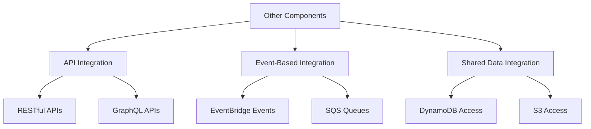

- **API-First Integration**: All functionality exposed via well-defined APIs
- **Event-Driven Communication**: Components can subscribe to relevant events
- **Shared Data Access**: Controlled access to shared data stores
- **SDK Integration**: Client libraries for common programming languages

### 5.2 Integration with Specific Components

1. **Knowledge Processing Service**:
   - Uses Component Registry API to register connectors
   - Consumes Configuration Service for connector settings
   - Publishes events for knowledge updates

2. **Tool Management Service**:
   - Registers tools via Component Registry API
   - Uses Configuration Service for tool settings
   - Integrates with Agent Framework for tool execution

3. **Agent Generation Service**:
   - Uses Agent Framework APIs to create agents
   - Consumes Workload Management for task distribution
   - Registers generated agents in Component Registry

4. **Agent Execution Service**:
   - Uses Workload Management for task execution
   - Consumes Agent Communication for messaging
   - Reports metrics to Resource Monitor

### 5.3 Complete Integration Landscape

The following diagram illustrates the complete integration landscape between the Foundation Layer and all other components:

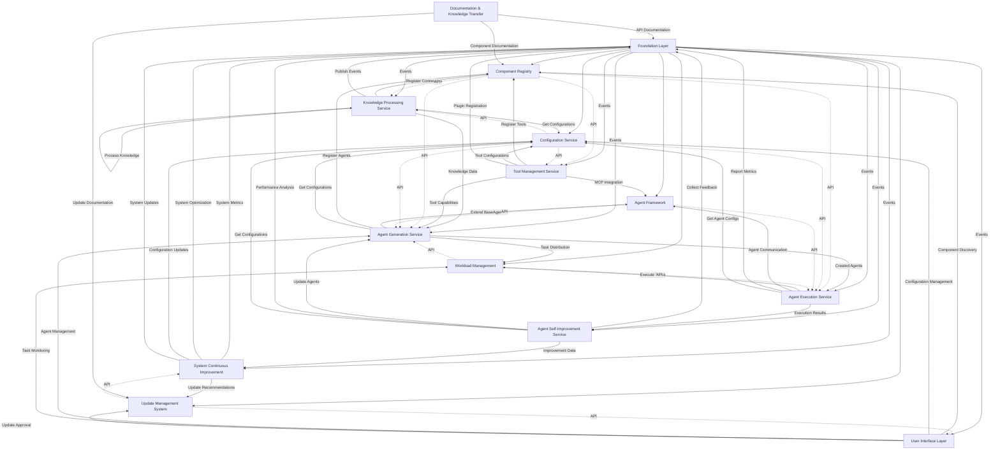

This diagram shows:

1. **Core Foundation Layer Components** (center) providing services to all other components
2. **Integration Points** between each component and the Foundation Layer
3. **Event Flow** showing how events propagate through the system
4. **Data Flow** illustrating how data moves between components
5. **API Relationships** showing which components consume which APIs

The Foundation Layer serves as the central hub that enables all other components to work together cohesively while maintaining independence and modularity.

## 6. Implementation Roadmap

### Phase 1: Core Infrastructure (Weeks 1-4)
- Set up AWS serverless infrastructure
- Implement Component Registry Service
- Implement Configuration Service
- Establish CI/CD pipeline

### Phase 2: Agent Framework (Weeks 5-8)
- Implement Agent Registry API
- Implement Agent Communication API
- Implement Framework Adapters API
- Integrate with Core Infrastructure

### Phase 3: Workload Management (Weeks 9-12)
- Implement Task Distributor API
- Implement Resource Monitor API
- Implement Quality Controller API
- Integrate with Agent Framework

### Phase 4: Self-Management (Weeks 13-16)
- Implement Monitoring & Alerting
- Implement Automated Remediation
- Implement Canary Deployments
- Implement Health Checks

### Phase 5: Integration & Testing (Weeks 17-20)
- Develop SDKs for other components
- Implement integration tests
- Perform load and resilience testing
- Create documentation and examples

## 7. Conclusion

This serverless architecture for the Foundation Layer provides a self-manageable, scalable, and resilient foundation for the Autonomous AI Agent Creator System. By leveraging fully managed AWS services, we minimize maintenance requirements while maximizing reliability and scalability.

The design emphasizes:
- **Self-Management**: Automated updates, monitoring, and healing
- **Scalability**: Automatic scaling based on demand
- **Resilience**: Redundancy and fault tolerance built-in
- **Flexibility**: Well-defined APIs for integration
- **Cost-Efficiency**: Pay-per-use pricing model

This approach allows the Foundation Layer to operate with minimal human intervention while providing the critical infrastructure needed by other components of the system.

## 8. Appendix: Update Mechanism Details

### 8.1 Update Recommendation Generation

The system uses a multi-faceted approach to generate recommendations:

**Automated Analysis**:
- **Dependency Scanner**: Regularly scans all dependencies against vulnerability databases (e.g., NVD, GitHub Advisory)
- **Version Monitor**: Checks for new versions of dependencies against package repositories
- **Usage Analytics**: Analyzes performance metrics to identify optimization opportunities
- **Compatibility Analyzer**: Uses static analysis to predict compatibility issues

**AI-Assisted Evaluation**:
- Evaluates release notes, changelogs, and community feedback
- Assesses impact on existing functionality
- Generates human-readable summaries of changes and their implications
- Assigns risk scores and confidence levels to recommendations

### 8.2 Tiered Update Approach

The system implements a tiered approach to self-updating:

**Tier 1: Fully Autonomous (No Human Intervention)**
- Security patches for known vulnerabilities
- Minor version updates of dependencies (patch/bug fixes)
- Performance optimizations based on usage patterns
- Configuration adjustments based on resource utilization

**Tier 2: Semi-Autonomous (Human Approval Required)**
- Major version updates of dependencies
- Conflict resolution between components
- Addition of new libraries/dependencies
- Feature additions or significant changes

**Tier 3: Human-Initiated (System Assists)**
- Architectural changes
- New integration patterns
- Changes to core interfaces

### 8.3 Testing & Deployment Strategy

**Staging Environment**:
- **Parallel Environments**: Maintain a complete staging environment that mirrors production
- **Shadow Testing**: New Foundation Layer version runs in parallel with current version
- **Integration Testing**: Automated tests with all 8 components against the new version

**Progressive Deployment**:
- **Blue/Green Deployment**: Maintain two identical environments with different versions
- **Canary Releases**: Deploy updates to a small subset of resources first
- **Progressive Exposure**: Gradually increase traffic to updated components
- **Automatic Rollback**: Revert to previous version if monitoring detects issues

**Version Management**:
- **Semantic Versioning**: Clear versioning scheme for all components
- **Version Matrix**: Compatibility matrix showing which component versions work together
- **Version Locking**: Components can specify compatible Foundation Layer versions
- **Backward Compatibility**: Maintain compatibility layers for smooth transitions

## 9. Cost Optimization Strategies

### 9.1 Infrastructure Cost Optimization

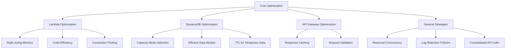

#### 9.1.1 Lambda Optimization

- **Right-sizing Memory**: Allocate appropriate memory to minimize execution time
- **Code Efficiency**: Optimize code to reduce execution duration
- **Connection Pooling**: Reuse connections across invocations
- **Estimated Savings**: 30-50% reduction in Lambda costs

#### 9.1.2 DynamoDB Optimization

- **Appropriate Capacity Mode**: On-demand for variable workloads, provisioned for predictable ones
- **Efficient Data Models**: Minimize secondary indexes, use sparse indexes
- **TTL for Temporary Data**: Automatically expire logs and temporary records
- **Estimated Savings**: 20-40% reduction in DynamoDB costs

#### 9.1.3 API Gateway Optimization

- **Response Caching**: Enable caching for frequently accessed endpoints
- **Request Validation**: Validate requests early to avoid unnecessary processing
- **Estimated Savings**: 15-30% reduction in API Gateway costs

#### 9.1.4 General Strategies

- **Reserved Concurrency**: For critical Lambda functions
- **CloudWatch Logs Retention**: Set appropriate retention periods
- **Consolidated API Calls**: Batch operations where possible
- **Estimated Savings**: 10-20% overall cost reduction

### 9.2 LLM Cost Optimization

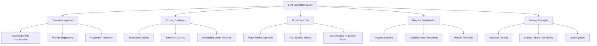

#### 9.2.1 Token Usage Monitoring and Optimization

- **Context Length Management**: Optimize prompt templates to reduce token count
- **Prompt Engineering**: Design efficient prompts that achieve results with fewer tokens
- **Response Truncation**: Request only necessary information in responses
- **Token Usage Analytics**: Track token usage by component, agent, and operation
- **Estimated Savings**: 20-30% reduction in token usage

#### 9.2.2 Caching Strategies

- **Response Caching**: Cache common LLM responses to avoid redundant calls
- **Semantic Caching**: Cache responses based on semantic similarity, not exact matches
- **Embedding-based Retrieval**: Use embeddings to find similar previous responses
- **Cache Invalidation Policies**: Define clear rules for when cached responses expire
- **Estimated Savings**: 30-50% reduction in LLM API calls

#### 9.2.3 Model Selection Logic

- **Tiered Model Approach**: Use smaller models for simpler tasks, larger models for complex reasoning
- **Task-Specific Models**: Select models optimized for specific types of tasks
- **Local Models for Simple Tasks**: Use smaller locally-deployed models when appropriate
- **Dynamic Model Selection**: Automatically select the most cost-effective model based on task requirements
- **Estimated Savings**: 40-60% reduction in average cost per task

#### 9.2.4 Batching and Request Optimization

- **Request Batching**: Combine multiple operations into single LLM calls where possible
- **Asynchronous Processing**: Queue non-urgent tasks for batch processing
- **Parallel Requests**: Process independent tasks simultaneously
- **Request Prioritization**: Prioritize critical path operations
- **Estimated Savings**: 15-25% reduction in total requests

#### 9.2.5 Testing-Specific Optimizations

- **Synthetic Data**: Use synthetic interactions for load testing instead of real LLM calls
- **Tiered Testing**: Use cheaper models during development, premium models for final validation
- **Logging Levels**: Implement detailed logging during testing, but make it configurable
- **Usage Quotas**: Set daily/weekly limits during testing phases
- **Estimated Savings**: 30-50% during testing phases

### 9.3 Cost Monitoring and Governance

- **Budget Alerts**: Set up alerts for approaching budget thresholds
- **Cost Attribution**: Track costs by component, feature, and client
- **Usage Dashboards**: Real-time visibility into cost drivers
- **Optimization Recommendations**: Automated identification of cost optimization opportunities
- **Cost Forecasting**: Predict future costs based on usage patterns

## 10. Intellectual Property and Data Separation

### 10.1 IP Protection Architecture with Client Ownership Model

#### 10.1.0 Client Ownership Principles

- **Client-Generated Agents**: All AI agents generated specifically for a client are the client's intellectual property
- **Client Data Ownership**: All client-specific knowledge, configurations, and data remain the client's property
- **System IP Boundaries**: The builder system, core algorithms, and generation capabilities remain the service provider's IP
- **Exportable Architecture**: All generated agents must be designed to be fully exportable and self-contained

```mermaid
graph TD
    A[IP Protection] --> B[Code/Data Separation]
    A --> C[Deployment Models]
    A --> D[Access Control]
    A --> E[Licensing Framework]
    A --> F[Client Ownership]
    
    B --> B1[Core IP in Foundation Layer]
    B --> B2[Client Data Isolation]
    B --> B3[Knowledge Processing Boundaries]
    
    C --> C1[SaaS Model]
    C --> C2[On-Premise Deployment]
    C --> C3[Hybrid Deployment]
    C --> C4[Agent Export]
    
    D --> D1[API Authentication]
    D --> D2[Feature-Based Access]
    D --> D3[Usage Tracking]
    
    E --> E1[Licensing Service]
    E --> E2[Feature Entitlements]
    E --> E3[Usage Limitations]
    
    F --> F1[Client-Owned Agents]
    F --> F2[Export Capabilities]
    F --> F3[Deployment Options]
```

#### 10.1.1 Code and Data Separation

- **Core IP in Foundation Layer**: Intellectual property of the service provider resides in the code, not the data
- **Client Data Isolation**: Complete isolation of client data in separate storage
- **Knowledge Processing Boundaries**: Clear separation between processing logic and processed data
- **Stateless Processing**: Process client data without persisting it in the core system
- **Agent Ownership Boundaries**: Clear delineation between system components and client-owned agents

#### 10.1.2 Deployment Models Supporting Client Ownership

- **SaaS Model**: Core IP remains on service provider infrastructure, clients access via APIs
- **On-Premise Deployment**: Deploy compiled/obfuscated system code to client infrastructure
- **Hybrid Deployment**: Critical IP components in SaaS, data processing on client infrastructure
- **Container Deployment**: Encapsulated system with access controls and usage monitoring
- **Agent Export**: Standardized formats for exporting client-owned agents (Docker, code repositories)

#### 10.1.3 Access Control and Licensing

- **API Authentication**: Secure access to system capabilities
- **Feature-Based Access Control**: Granular control over which capabilities clients can access
- **Usage Tracking and Limitations**: Monitor and enforce usage within license terms
- **Licensing Service**: Central service for managing client entitlements and access

#### 10.1.4 Data Governance and Ownership

- **Client Data Ownership**: Clear contractual terms establishing client ownership of their data and generated agents
- **Data Processing Agreement**: Transparent terms for how client data is processed
- **Data Retention Policies**: Defined policies for data handling and deletion
- **Audit Trails**: Comprehensive logging of data access and processing
- **Agent Ownership Documentation**: Clear documentation of client ownership of generated agents

#### 10.1.5 Data Encryption and Security Measures

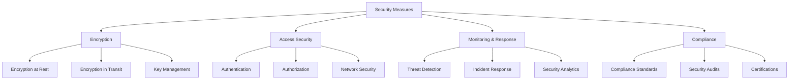

**Encryption Strategy**:

- **Data at Rest Encryption**:
  - **Client Data**: AES-256 encryption for all stored client data
  - **Knowledge Base**: Encrypted storage with client-specific encryption keys
  - **Configuration Data**: Encrypted with service-managed keys
  - **Key Rotation**: Automatic key rotation policies (90-day default)

- **Data in Transit Encryption**:
  - **API Communications**: TLS 1.3 for all API traffic
  - **Internal Communications**: Service-to-service encryption with mutual TLS
  - **Client Connections**: Certificate-based authentication and encryption
  - **Perfect Forward Secrecy**: Implemented for all connections

- **Key Management**:
  - **Client-Managed Keys**: Option for clients to provide their own encryption keys
  - **Key Hierarchy**: Multi-tier key management system
  - **Hardware Security Modules**: For root key protection
  - **Key Access Controls**: Strict access controls for encryption keys

**Access Security**:

- **Authentication**:
  - **Multi-Factor Authentication**: Required for administrative access
  - **OAuth 2.0/OIDC**: For API authentication
  - **JWT Tokens**: Short-lived access tokens with appropriate scopes
  - **Service Accounts**: Limited-privilege accounts for service-to-service communication

- **Authorization**:
  - **Role-Based Access Control**: Granular permissions based on roles
  - **Attribute-Based Access Control**: Context-aware access decisions
  - **Least Privilege Principle**: Minimal permissions required for each operation
  - **Just-In-Time Access**: Temporary elevated privileges with approval workflow

- **Network Security**:
  - **VPC Isolation**: Private network segments for sensitive components
  - **API Gateway**: Rate limiting, request validation, and threat protection
  - **WAF Rules**: Protection against common web vulnerabilities
  - **DDoS Protection**: Automatic mitigation of denial-of-service attacks

**Security Monitoring and Response**:

- **Continuous Monitoring**:
  - **Real-time Threat Detection**: Anomaly detection for suspicious activities
  - **Log Analysis**: Centralized logging with security event correlation
  - **Vulnerability Scanning**: Regular automated security scans
  - **Penetration Testing**: Scheduled security assessments

- **Incident Response**:
  - **Automated Remediation**: Predefined playbooks for common security events
  - **Alert Escalation**: Tiered notification system based on severity
  - **Forensic Capabilities**: Detailed audit trails for security investigations
  - **Recovery Procedures**: Documented processes for security incidents

**Compliance and Standards**:

- **Security Frameworks**:
  - **SOC 2**: Controls for security, availability, and confidentiality
  - **ISO 27001**: Information security management system
  - **GDPR Compliance**: Data protection measures for EU data
  - **HIPAA Compliance**: (Optional) For healthcare data processing

- **Security Documentation**:
  - **Security Policies**: Comprehensive documentation of security measures
  - **Compliance Reports**: Regular security compliance reporting
  - **Third-Party Audits**: Independent security assessments
  - **Shared Responsibility Model**: Clear delineation of security responsibilities

## 11. Agent Export and Client Ownership Implementation

### 11.1 Agent Export Architecture

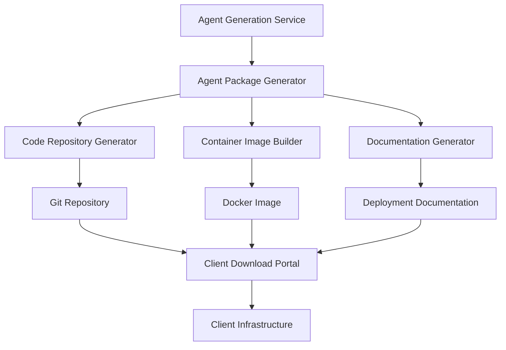

### 11.2 Export Formats and Standards
- **Code Repository**: Complete source code with dependency management
- **Container Images**: Ready-to-deploy Docker containers
- **Serverless Packages**: AWS Lambda/Azure Functions compatible packages
- **Documentation**: Auto-generated deployment and maintenance guides

### 11.3 Client Download Portal
- **Authentication**: Secure access to client-owned agents
- **Version Control**: Access to all versions of generated agents
- **Deployment Options**: One-click deployment to common platforms
- **Documentation**: Comprehensive guides for self-hosting

### 11.4 Update Mechanisms for Exported Agents
- **Version Checking**: Mechanism to check for system updates
- **Patch Application**: Secure method to apply patches to exported agents
- **Configuration Updates**: Method to update agent configurations
- **Knowledge Refresh**: Process to update agent knowledge bases

### 11.5 Business Model with Client Ownership

#### 11.5.1 Value-Added Services
- **Hosting & Management**: Fully managed hosting option for clients who prefer it
- **Maintenance & Updates**: Technical support and system updates
- **Integration Services**: Help connecting agents to client systems
- **Training & Support**: Onboarding and ongoing assistance

#### 11.5.2 Tiered Pricing Model
- **Base Tier**: Agent generation and export capabilities
- **Standard Tier**: Adds hosting, basic updates, and support
- **Premium Tier**: Adds advanced monitoring, priority updates, and dedicated support

#### 11.5.3 Update Subscription
- **System Improvements**: Ongoing access to system improvements
- **Security Patches**: Vulnerability fixes and security updates
- **Knowledge Refreshes**: Updates to knowledge bases and processing