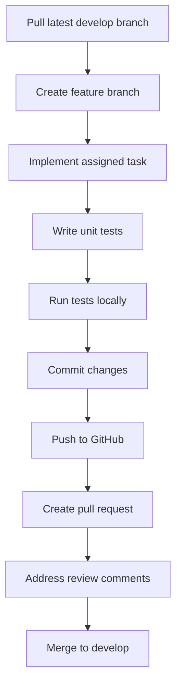

# GitHub Workflow Guide for Foundation Layer Implementation

This guide outlines the process for setting up a GitHub repository for the Foundation Layer implementation and managing daily tasks for junior developers.

## Repository Setup

### 1. Create GitHub Repository

```bash
# Initialize repository locally
git init

# Add all files
git add .

# Initial commit
git commit -m "Initial commit: Foundation Layer structure and implementation guides"

# Create repository on GitHub (replace with your organization name)
# You can also do this through the GitHub web interface
gh repo create your-org/chatbot-agents-creator --public

# Add remote and push
git remote add origin https://github.com/your-org/chatbot-agents-creator.git
git push -u origin main
```

### 2. Branch Structure

Establish a clear branch structure:

- `main` - Stable, production-ready code
- `develop` - Integration branch for ongoing development
- `feature/*` - Feature branches for individual tasks
- `bugfix/*` - Bug fix branches
- `release/*` - Release preparation branches

### 3. Protection Rules

Set up branch protection rules for `main` and `develop`:

1. Require pull request reviews before merging
2. Require status checks to pass before merging
3. Require linear history
4. Include administrators in these restrictions

## Task Management

### 1. GitHub Issues

Create issues for each task in the implementation status file:

1. Use a consistent naming convention: `[Component] Task description`
2. Add appropriate labels: `component:config-manager`, `priority:high`, `day:1`, etc.
3. Assign to milestones representing implementation phases
4. Include detailed descriptions with acceptance criteria

### 2. Task Board

Set up a GitHub Project board with the following columns:

1. **Backlog** - All pending tasks
2. **Ready for Development** - Tasks ready to be assigned
3. **In Progress** - Tasks currently being worked on
4. **Review** - Tasks awaiting code review
5. **Done** - Completed tasks

### 3. Daily Task Assignment

For each developer:

1. Assign 1-day worth of tasks from the "Ready for Development" column
2. Move assigned tasks to "In Progress"
3. Create a feature branch for each task: `feature/config-manager-load-config`
4. Assign the issue to the developer

## Developer Workflow

### 1. Daily Workflow



### 2. Pull Request Process

1. Create a pull request from feature branch to `develop`
2. Fill out the pull request template
3. Request review from team lead
4. Address any review comments
5. Merge once approved

### 3. End of Day Process

1. Submit pull request for completed tasks
2. Update task status in the project board
3. Document any challenges or blockers
4. Prepare for next day's tasks

## Code Quality Standards

### 1. Commit Guidelines

Follow conventional commits:

```
feat: add load_config method to ConfigManager
fix: resolve issue with dependency resolution
docs: update implementation guide for Component Registry
test: add unit tests for ConfigManager
```

### 2. Code Review Checklist

- Code follows implementation guides
- All tests pass
- Documentation is updated
- No unnecessary dependencies
- Follows coding standards
- Implements client ownership correctly

### 3. Testing Requirements

- Unit tests for all public methods
- Integration tests for component interactions
- Test coverage > 80%

## Daily Task Examples

Here are examples of one-day task assignments for junior developers:

### Day 1: Config Manager Core Implementation

**Developer A:**
1. Implement `ConfigSource` base class
2. Implement `FileConfigSource` class
3. Implement `load_config` method in `ConfigManager`
4. Implement `get_config` and `set_config` methods
5. Write unit tests for implemented methods

### Day 2: Config Manager Client Ownership

**Developer A:**
1. Implement client-specific configuration isolation
2. Add owner_id support to ConfigManager
3. Implement `get_client_config` method
4. Implement configuration export/import
5. Write unit tests for client ownership features

### Day 3: Component Registry Core Implementation

**Developer B:**
1. Implement `ComponentMetadata` class
2. Implement `register_component` method
3. Implement component retrieval methods
4. Implement dependency resolution
5. Write unit tests for implemented methods

### Day 4: Component Registry Client Ownership

**Developer B:**
1. Add ownership tracking to Component Registry
2. Implement `get_components_by_owner` method
3. Implement component export functionality
4. Add access control based on ownership
5. Write unit tests for client ownership features

## Task Tracking Template

```markdown
## Daily Task Assignment: [Date]

### Developer: [Name]

#### Tasks:
1. [ ] [Issue #XX] Implement method X in Component Y
2. [ ] [Issue #XX] Add unit tests for method X
3. [ ] [Issue #XX] Update documentation for Component Y

#### Expected Deliverables:
- Pull request with implementation of method X
- Unit tests with >80% coverage
- Updated documentation

#### Resources:
- Implementation guide: [Link]
- Reference implementation: [Link]
- Related components: [List]

#### Notes:
- Pay special attention to client ownership aspects
- Coordinate with Developer Z who is working on related component
```

## Weekly Review Process

1. **Code Review Session**: Review all merged PRs from the week
2. **Progress Assessment**: Evaluate completion against implementation plan
3. **Knowledge Sharing**: Developers present their implementations
4. **Planning**: Adjust next week's tasks based on progress

## Conclusion

This workflow ensures that junior developers have clear, manageable daily tasks while maintaining code quality and consistent implementation. The daily assignment and review cycle provides regular feedback and keeps the project on track.

By following this GitHub workflow, we can efficiently implement the Foundation Layer with proper task distribution, code quality, and progress tracking.