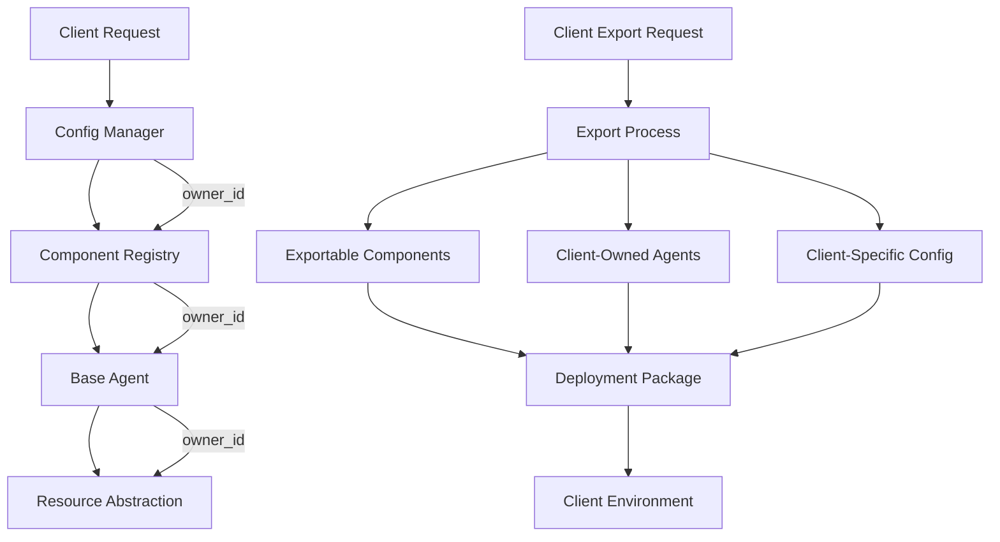

# Client Ownership Integration Guide

This guide explains how client ownership is implemented across components in the Foundation Layer. It provides a comprehensive overview of the client ownership model and how it's integrated into the system architecture.

## Overview

The client ownership model is a core design principle that ensures AI agents built specifically for a client are the client's property. This principle is implemented throughout the Foundation Layer to enable clear ownership boundaries, exportable agents, and client-specific configurations.

## Client Ownership Model

### Core Principles

1. **Client-Owned Agents**: AI agents built specifically for a client are the client's intellectual property
2. **Exportable Architecture**: Client-owned components must be exportable for deployment in client environments
3. **Clear IP Boundaries**: System components and client-specific components have clear ownership boundaries
4. **Data Isolation**: Client-specific data is isolated and protected

### Implementation Strategy

The client ownership model is implemented through:

1. **Ownership Metadata**: All components include ownership information
2. **Export Capabilities**: Components can be exported for client deployment
3. **Access Control**: Ownership-based access to components and data
4. **Configuration Isolation**: Client-specific configurations are isolated

## Component-Level Integration

### 1. Config Manager

The Config Manager supports client ownership through:

```python
class ConfigManager:
    def __init__(self, 
                 config_sources: List[ConfigSource] = None,
                 schema_file: Optional[str] = None,
                 owner_id: Optional[str] = None,  # Client ownership identifier
                 environment: str = "development"):
        # ...
        
    def get_client_config(self, client_id: str) -> Dict[str, Any]:
        """Get configuration specific to a client"""
        # ...
        
    def export_config(self, format: str = "json") -> str:
        """Export configuration for client deployment"""
        # ...
```

Key features:
- Client-specific configuration isolation
- Configuration export for client deployment
- Secure storage for sensitive configuration values

### 2. Component Registry

The Component Registry supports client ownership through:

```python
@dataclass
class ComponentMetadata:
    # ...
    owner_id: Optional[str] = None  # Client ownership identifier
    exportable: bool = False  # Whether component can be exported

class ComponentRegistry:
    # ...
    def get_components_by_owner(self, owner_id: str) -> List[Any]:
        """Get all components owned by a specific client"""
        # ...
        
    def export_component(self, name: str, format: str = "json") -> Dict[str, Any]:
        """Export a component for client deployment"""
        # ...
```

Key features:
- Component ownership tracking
- Exportable component support
- Owner-based component retrieval

### 3. Base Agent

The Base Agent supports client ownership through:

```python
class BaseAgent:
    def __init__(self, config):
        self.config = config
        self.owner_id = config.get('owner_id')  # Client ownership metadata
        self.ownership_type = config.get('ownership_type', 'system')  # 'system' or 'client'
        self.exportable = config.get('exportable', False)  # Whether this agent can be exported
        
    def prepare_for_export(self, export_format='source'):
        """Prepare agent for export in the specified format"""
        # ...
```

Key features:
- Ownership metadata in agent configuration
- Export preparation for client deployment
- Ownership type distinction (system vs. client)

### 4. Resource Abstraction

The Resource Abstraction layer supports client ownership through:

```python
class ResourceAbstraction:
    # ...
    def package_for_export(self, resources, export_format):
        """Package resources for export in the specified format"""
        # ...
```

Key features:
- Resource packaging for client deployment
- Environment-specific resource configuration
- Secure communication for remote resources

### 5. Extension System

The Extension System supports client ownership through:

```python
class ExtensionSystem:
    # ...
    def add_extension(self, extension_point: str, name: str, extension: Any, owner_id: Optional[str] = None):
        """Add an extension with ownership information"""
        # ...
        
    def get_extensions_by_owner(self, extension_point: str, owner_id: str) -> List[Any]:
        """Get extensions owned by a specific client"""
        # ...
        
    def export_extensions(self, owner_id: str) -> Dict[str, Any]:
        """Export extensions owned by a client"""
        # ...
```

Key features:
- Extension ownership tracking
- Owner-based extension retrieval
- Extension export for client deployment

## Data Flow for Client Ownership

The following diagram illustrates how client ownership metadata flows through the system:



## Implementation Steps

### 1. Add Ownership Metadata

Add ownership metadata to all component configurations:

```json
{
  "components": {
    "my_component": {
      "owner_id": "client123",
      "exportable": true,
      "ownership_type": "client"
    }
  }
}
```

### 2. Implement Export Capabilities

Implement export methods in all components that need to be exportable:

```python
def export(self, format="json"):
    """
    Export component for client deployment
    
    Args:
        format: Export format (json, yaml)
        
    Returns:
        Component export data
    """
    export_data = {
        "name": self.name,
        "version": self.version,
        "config": self.config,
        "state": self.get_state()
    }
    
    return export_data
```

### 3. Add Ownership Validation

Add ownership validation to component access:

```python
def access_component(self, component_name, requester_id):
    """
    Access a component with ownership validation
    
    Args:
        component_name: Name of the component to access
        requester_id: ID of the requester
        
    Returns:
        Component instance or None if access denied
    """
    component = self.get_component(component_name)
    if not component:
        return None
        
    metadata = self.get_component_metadata(component_name)
    
    # System components can be accessed by anyone
    if not metadata.owner_id or metadata.owner_id == "system":
        return component
        
    # Client components can only be accessed by their owner
    if metadata.owner_id == requester_id:
        return component
        
    # Access denied
    return None
```

### 4. Implement Client-Specific Configuration

Implement client-specific configuration isolation:

```python
def get_config(self, key, default=None, client_id=None):
    """
    Get configuration value with client isolation
    
    Args:
        key: Configuration key
        default: Default value if key not found
        client_id: Client ID for client-specific configuration
        
    Returns:
        Configuration value
    """
    if client_id and f"clients.{client_id}.{key}" in self.config:
        return self.config[f"clients.{client_id}.{key}"]
    
    return self.config.get(key, default)
```

## Export Process

The export process for client-owned components involves:

1. **Identify Exportable Components**: Find all components marked as exportable and owned by the client
2. **Export Component Data**: Call export method on each component to get export data
3. **Package Dependencies**: Include all required dependencies
4. **Generate Documentation**: Create documentation for the exported components
5. **Create Deployment Package**: Package everything into a deployable format

Example export process:

```python
def export_client_components(client_id, format="json"):
    """
    Export all components owned by a client
    
    Args:
        client_id: Client ID
        format: Export format (json, yaml)
        
    Returns:
        Export data for all client components
    """
    # Get component registry
    registry = get_component_registry()
    
    # Get all components owned by the client
    components = registry.get_components_by_owner(client_id)
    
    # Export data for each component
    export_data = {}
    for component in components:
        metadata = registry.get_component_metadata(component.__class__.__name__)
        if metadata.exportable:
            export_data[component.__class__.__name__] = registry.export_component(component.__class__.__name__, format)
    
    # Get config manager
    config_manager = get_config_manager()
    
    # Export client-specific configuration
    client_config = config_manager.get_client_config(client_id)
    export_data["config"] = client_config
    
    # Get extension system
    extension_system = get_extension_system()
    
    # Export client-owned extensions
    extensions = extension_system.export_extensions(client_id)
    export_data["extensions"] = extensions
    
    return export_data
```

## Deployment Options

Client-owned components can be deployed in various ways:

1. **Docker Container**: Package components into a Docker container
2. **Serverless Functions**: Deploy as AWS Lambda or Azure Functions
3. **Source Code**: Provide source code for client integration
4. **Python Package**: Create a pip-installable package

Example deployment configuration:

```yaml
deployment:
  type: docker
  image: client-agent-image
  version: 1.0.0
  components:
    - client_processor
    - client_agent
  config:
    environment: production
    logging:
      level: info
  resources:
    memory: 512Mi
    cpu: 0.5
```

## Testing Client Ownership

Create unit tests to verify client ownership functionality:

1. **Ownership Metadata**: Test that components have correct ownership metadata
2. **Access Control**: Test that client components can only be accessed by their owner
3. **Export Process**: Test that client components can be exported correctly
4. **Deployment**: Test that exported components can be deployed and run correctly

Example test:

```python
def test_client_ownership():
    # Create component registry
    registry = ComponentRegistry()
    
    # Register client-owned component
    client_component = ClientComponent()
    registry.register_component(client_component, ComponentMetadata(
        name="client_processor",
        version="1.0.0",
        description="Client-specific data processor",
        owner_id="client123",
        exportable=True
    ))
    
    # Test ownership retrieval
    client_components = registry.get_components_by_owner("client123")
    assert len(client_components) == 1
    assert client_components[0] == client_component
    
    # Test export
    export_data = registry.export_component("client_processor")
    assert export_data["name"] == "client_processor"
    assert export_data["version"] == "1.0.0"
    
    # Test access control
    assert registry.access_component("client_processor", "client123") == client_component
    assert registry.access_component("client_processor", "other_client") is None
```

## Best Practices

1. **Clear Ownership Boundaries**: Always clearly define ownership of components
2. **Exportable by Default**: Make client-owned components exportable by default
3. **Minimal Dependencies**: Minimize dependencies on system components for client-owned components
4. **Complete Documentation**: Provide comprehensive documentation for exported components
5. **Versioning**: Use semantic versioning for all components
6. **Testing**: Test export and deployment processes thoroughly

## Integration with Other Components

The client ownership model integrates with other components in the following ways:

1. **Knowledge Processing Service**: Client-specific knowledge is isolated and exportable
2. **Tool Management Service**: Client-owned tools are tracked and exportable
3. **Agent Generation Service**: Generated agents include ownership metadata
4. **Agent Execution Service**: Execution respects ownership boundaries
5. **UI Layer**: Provides ownership-aware interfaces for managing components

## Conclusion

The client ownership model is a fundamental aspect of the Foundation Layer that ensures clear ownership boundaries and exportable architecture. By implementing ownership metadata, export capabilities, and access control throughout the system, we enable clients to truly own their AI agents and deploy them in their own environments.