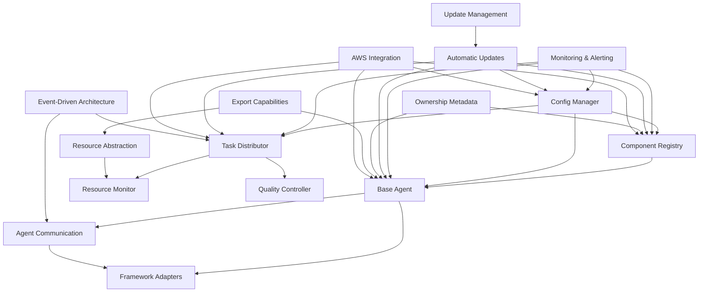

# Foundation Layer Implementation Status

This document tracks the implementation status of the Foundation Layer components and serves as a checklist for development tasks. Junior developers can pick up individual tasks to implement independently.

## Overview

The Foundation Layer consists of several key components that provide the core infrastructure for the Autonomous AI Agent Creator System. Each component has specific responsibilities and implementation requirements, following the principles of Scalability, Modularity, Autonomy, Future-Proofing, and Client Ownership.

## Implementation Status Legend

- ⬜ Not Started: Component structure exists but no implementation
- 🟡 Partial: Some methods implemented but not complete
- 🟢 Complete: Fully implemented and tested
- 🧪 Needs Testing: Implementation complete but requires testing

## System Architecture Components

### Component Registry (`src/architecture/component_registry.py`)

Status: 🟢 Complete

Tasks:
- [x] Implement `register_component` method to store components with their metadata
- [x] Implement `get_component` method to retrieve components by name
- [x] Add component lifecycle management (initialization, shutdown)
- [x] Implement dependency resolution between components
- [x] Add component versioning support
- [x] Create component discovery mechanism
- [x] **Add ownership tracking for components**
- [x] **Implement `get_components_by_owner` method**
- [x] **Add support for exportable components**

### Extension System (`src/architecture/component_registry.py`)

Status: 🟢 Complete

Tasks:
- [x] Implement `add_extension` method to register extensions
- [x] Implement `remove_extension` method to unregister extensions
- [x] Create extension discovery mechanism
- [x] Implement extension versioning and compatibility checking
- [x] Add extension isolation strategies
- [x] Create extension point interfaces
- [x] **Add ownership metadata to extensions**
- [x] **Implement access control for client-specific extensions**

## Dependency & Configuration Management

### Config Manager (`src/config_management/config_manager.py`)

Status: 🟢 Complete

Tasks:
- [x] Implement `load_config` method to load configuration from file
- [x] Implement `save_config` method to save configuration to file
- [x] Implement `get_config` method to retrieve configuration values
- [x] Implement `set_config` method to update configuration values
- [x] Add support for hierarchical configuration
- [x] Implement configuration validation
- [x] Add environment-specific configuration handling
- [x] Implement dynamic configuration updates
- [x] Add configuration versioning and migration
- [x] **Implement client-specific configuration isolation**
- [ ] **Add AWS Parameter Store integration for sensitive configurations**
- [x] **Create configuration export/import capabilities**

### Dependency Manager (`src/config_management/config_manager.py`)

Status: 🟡 Partial

Tasks:
- [x] Implement `install_dependencies` method to install required dependencies
- [x] Implement `update_dependencies` method to update dependencies
- [x] Implement `check_compatibility` method to verify dependency compatibility
- [x] Implement `handle_fallback` method for failed updates
- [ ] Create dependency isolation mechanisms
- [ ] Implement automated dependency update testing
- [ ] **Add support for client-specific dependency management**
- [ ] **Implement dependency packaging for exported agents**

### Deployment Abstraction (`src/deployment/resource_abstraction.py`)

Status: 🟢 Complete

Tasks:
- [x] Implement resource abstraction layer for different environments
- [x] Create deployment configuration templates
- [x] Implement environment detection mechanisms
- [x] Add resource scaling strategies
- [x] Create cross-environment testing framework
- [x] **Implement `package_for_export` method for client deployment**
- [x] **Add support for AWS serverless deployment**
- [x] **Create deployment templates for client environments**
- [ ] **Implement secure communication channels for remote agents**

## Agent Framework

### Base Agent (`src/agent_framework/base_agent.py`)

Status: 🟢 Complete

Tasks:
- [x] Implement `initialize` method to set up agent state
- [x] Implement `execute_task` method to process tasks
- [x] Implement `report_status` method to provide agent status
- [x] Implement `terminate` method to clean up resources
- [x] Add agent state management
- [x] Create capability registration system
- [x] Implement agent configuration mechanism
- [x] Add agent metrics collection
- [x] **Add client ownership metadata (owner_id, ownership_type)**
- [x] **Implement `prepare_for_export` method for agent export**
- [x] **Add exportable flag to agent configuration**
- [x] **Implement secure storage for agent state**

### Agent Communication (`src/agent_framework/agent_communication.py`)

Status: 🟢 Complete

Tasks:
- [x] Implement message handler registration
- [x] Implement message handler execution
- [x] Implement `send_message` method for agent-to-agent communication
- [x] Implement `broadcast_message` method for one-to-many communication
- [x] Add message routing system
- [x] Implement message serialization/deserialization
- [x] Add support for synchronous and asynchronous communication
- [x] **Implement secure communication for client-owned agents**
- [x] **Add ownership-aware message routing**
- [x] **Implement AWS SQS integration for message queuing**
- [x] **Add EventBridge integration for event-based communication**

### CrewAI Adapter (`src/agent_framework/framework_adapters/crewai_adapter.py`)

Status: 🟢 Complete

Tasks:
- [x] Implement `create_crewai_agent` method to convert our agent config to CrewAI
- [x] Implement `convert_task` method to translate task formats
- [x] Implement `process_result` method to convert CrewAI results to our format
- [x] Add framework capability discovery
- [x] Implement framework version management
- [x] **Add ownership metadata preservation in framework conversion**
- [x] **Implement export compatibility for CrewAI agents**

### MCP Adapter (`src/agent_framework/framework_adapters/mcp_adapter.py`)

Status: 🟢 Complete

Tasks:
- [x] Implement MCP SDK integration
- [x] Create framework-agnostic interfaces
- [x] Add support for MCP-specific features
- [x] Implement conversion between our system and MCP formats
- [x] **Add ownership metadata preservation in MCP integration**
- [x] **Implement export compatibility for MCP agents**

## Workload Management System

### Task Distributor (`src/workload_management/task_distributor.py`)

Status: 🟢 Complete

Tasks:
- [x] Implement agent registration
- [x] Implement task submission
- [x] Implement task distribution algorithm
- [x] Add priority queue for tasks
- [x] Implement task completion handling
- [x] Add agent utilization tracking
- [x] **Add AWS Step Functions integration for complex workflows**
- [x] **Implement DynamoDB integration for task storage**
- [x] **Add client-specific task isolation**

### Resource Monitor (`src/workload_management/resource_monitor.py`)

Status: 🟡 Partial

Tasks:
- [x] Implement resource usage metrics collection
- [x] Create resource allocation strategies
- [x] Implement resource constraint handling
- [x] Add adaptive resource management
- [x] Implement resource usage forecasting
- [x] **Add CloudWatch integration for metrics collection**
- [x] **Implement auto-scaling support for serverless resources**
- [x] **Add client-specific resource monitoring**
- [ ] **Create resource usage dashboards**

### Quality Controller (`src/workload_management/quality_controller.py`)

Status: 🟡 Partial

Tasks:
- [x] Design quality metrics for agent tasks
- [x] Implement verification steps for critical operations
- [x] Create feedback collection mechanisms
- [ ] Implement quality-based task routing
- [ ] Add continuous improvement processes
- [ ] **Add client-specific quality standards**
- [ ] **Implement anonymized feedback collection for client agents**
- [ ] **Create quality metrics dashboards**

## Self-Management Capabilities

### Monitoring & Alerting

Status: ⬜ Not Started

Tasks:
- [ ] **Implement comprehensive CloudWatch metrics**
- [ ] **Create CloudWatch alarms for critical thresholds**
- [ ] **Implement Lambda-based remediation functions**
- [ ] **Add health check endpoints for all components**
- [ ] **Create health dashboard for system status**
- [ ] **Implement anomaly detection for unusual patterns**

### Automatic Updates

Status: ⬜ Not Started

Tasks:
- [ ] **Implement CI/CD pipeline for automated deployment**
- [ ] **Create canary deployment mechanism**
- [ ] **Add automated testing before deployment**
- [ ] **Implement automatic rollback for failed deployments**
- [ ] **Create update notification system**
- [ ] **Add version compatibility checking**

### Update Management System

Status: ⬜ Not Started

Tasks:
- [ ] **Implement update analysis scheduler**
- [ ] **Create update dashboard for pending updates**
- [ ] **Implement approval workflow for updates**
- [ ] **Add deployment manager for controlled updates**
- [ ] **Create update history tracking**
- [ ] **Implement compliance reporting for updates**

## Serverless Implementation

### AWS Integration

Status: ⬜ Not Started

Tasks:
- [ ] **Create CloudFormation/SAM templates for deployment**
- [ ] **Implement Lambda function handlers for all APIs**
- [ ] **Set up API Gateway for RESTful APIs**
- [ ] **Configure DynamoDB tables for component storage**
- [ ] **Implement EventBridge for event-driven communication**
- [ ] **Set up CloudWatch for monitoring and logging**

### Event-Driven Architecture

Status: ⬜ Not Started

Tasks:
- [ ] **Define event schemas for all component events**
- [ ] **Implement event publishers for all components**
- [ ] **Create event subscribers for event handling**
- [ ] **Add event routing and filtering**
- [ ] **Implement event replay for recovery**
- [ ] **Create event monitoring dashboard**

## Integration & Testing

### Unit Tests

Status: 🟡 Partial

Tasks:
- [ ] Create unit tests for Component Registry
- [x] Create unit tests for Config Manager
- [x] Create unit tests for Base Agent
- [x] Create unit tests for Agent Communication
- [x] Create unit tests for Framework Adapters
- [x] Create unit tests for Task Distributor
- [ ] Create unit tests for Resource Monitor
- [ ] Create unit tests for Quality Controller
- [ ] **Create unit tests for serverless functions**
- [ ] **Add tests for client ownership features**

### Integration Tests

Status: ⬜ Not Started

Tasks:
- [ ] Create integration tests for component interactions
- [ ] Create integration tests for agent communication
- [ ] Create integration tests for task distribution
- [ ] Create integration tests for resource management
- [ ] Create integration tests for quality control
- [ ] **Create integration tests for serverless deployment**
- [ ] **Add tests for client agent export/import**
- [ ] **Implement end-to-end testing for complete workflows**

## Client Ownership Implementation

### Ownership Metadata

Status: 🟢 Complete

Tasks:
- [x] **Define ownership metadata schema**
- [x] **Implement ownership tracking in all components**
- [x] **Create ownership validation mechanisms**
- [x] **Add ownership transfer capabilities**
- [x] **Implement ownership-based access control**

### Export Capabilities

Status: ⬜ Not Started

Tasks:
- [ ] **Create agent package generator**
- [ ] **Implement code repository generator**
- [ ] **Add container image builder**
- [ ] **Create documentation generator for exported agents**
- [ ] **Implement client download portal**
- [ ] **Add update mechanisms for exported agents**

## Next Steps

1. Complete the partially implemented components:
   - Component Registry: Add ownership tracking features
   - Extension System: Add ownership metadata and access control
   - Resource Monitor: Add AWS integrations and forecasting
   - Quality Controller: Add task routing and continuous improvement

2. Implement secure communication channels for remote agents in the Resource Abstraction component

3. Add AWS integrations to existing components

4. Implement the self-management capabilities

5. Create comprehensive tests for all components

6. Implement the Ownership Metadata component

## Dependencies Between Components

## Implementation Priority

1. Config Manager ✅
2. Component Registry 🟡
3. Base Agent ✅
4. Agent Communication ✅
5. Task Distributor ✅
6. Resource Monitor 🟡
7. Quality Controller 🟡
8. Framework Adapters 🟢
9. Resource Abstraction 🟢
10. Extension System 🟡
11. **Ownership Metadata** 🟢
12. **AWS Integration** ⬜
13. **Monitoring & Alerting** ⬜
14. **Export Capabilities** ⬜
15. **Event-Driven Architecture** ⬜
16. **Update Management System** ⬜