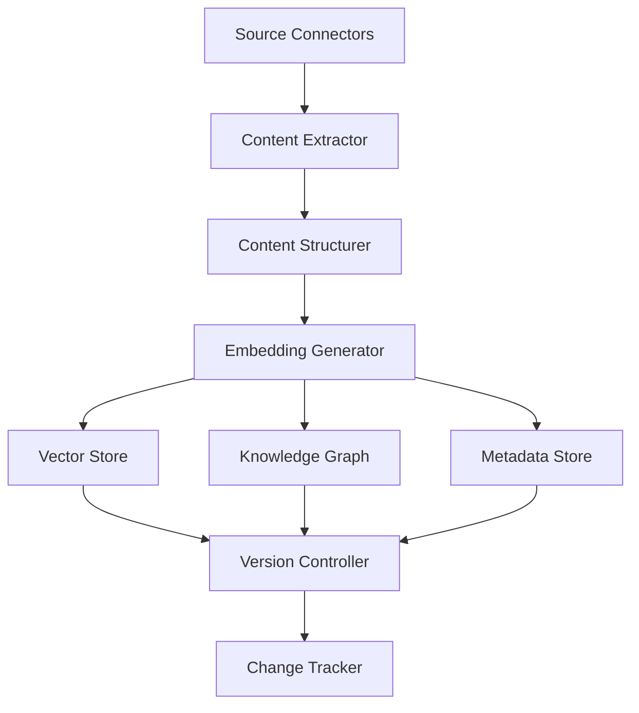

# Knowledge Processing Service Implementation Status

This document tracks the implementation status of the Knowledge Processing Service components and serves as a checklist for development tasks.

## Overview

The Knowledge Processing Service consists of several key components that provide the infrastructure for processing and managing knowledge from various sources. Each component has specific responsibilities and implementation requirements, following the principles of Scalability, Modularity, Autonomy, and Future-Proofing.

## Implementation Status Legend

- ⬜ Not Started: Component structure exists but no implementation
- 🟡 Partial: Some methods implemented but not complete
- 🟢 Complete: Fully implemented and tested
- 🧪 Needs Testing: Implementation complete but requires testing

## Source Connector System

### Connector Base (`src/connectors/connector_base.py`)

Status: 🟢 Complete

Tasks:
- [x] Design connector interface
- [x] Implement parameter and result schema validation
- [x] Create connector registry with discovery mechanisms
- [x] Develop connector metadata management
- [x] Build connector versioning and compatibility checking
- [x] Design connector dependency management

### Document Connector (`src/connectors/document_connector.py`)

Status: 🟢 Complete

Tasks:
- [x] Implement document file handling
- [x] Create content extraction for different file types
- [x] Implement recursive directory scanning
- [x] Add file metadata extraction
- [x] Implement versioning and metadata
- [x] Register with connector registry

### Database Connector (`src/connectors/database_connector.py`)

Status: 🟡 Partial

Tasks:
- [x] Implement basic database connection handling
- [x] Create query execution methods
- [x] Add table extraction capabilities
- [x] Implement schema discovery
- [x] Add support for different database types
- [x] Implement connection pooling
- [x] Add versioning and metadata
- [x] Register with connector registry

### API Connector (`src/connectors/api_connector.py`)

Status: 🟡 Partial

Tasks:
- [x] Implement REST API connection handling
- [x] Create GraphQL support
- [x] Add authentication methods
- [x] Implement rate limiting
- [x] Add pagination handling
- [ ] Create response caching
- [x] Add versioning and metadata
- [x] Register with connector registry

### Web Connector (`src/connectors/web_connector.py`)

Status: 🟡 Partial

Tasks:
- [x] Implement web page fetching
- [x] Create HTML content extraction
- [x] Add link discovery and crawling
- [ ] Implement robots.txt compliance
- [ ] Add rate limiting and politeness
- [ ] Create content filtering
- [ ] Add versioning and metadata
- [ ] Register with connector registry

## Content Processing Pipeline

### Content Extractor (`src/processing/content_extractor.py`)

Status: 🟡 Partial

Tasks:
- [x] Implement text extraction from raw content
- [x] Create metadata extraction
- [ ] Add support for different content types
- [ ] Implement content cleaning
- [ ] Create content validation
- [ ] Add error handling and recovery

### Content Structurer (`src/processing/content_structurer.py`)

Status: 🟡 Partial

Tasks:
- [x] Implement content chunking
- [x] Create section identification
- [ ] Add semantic boundary detection
- [ ] Implement hierarchical structuring
- [ ] Create relationship identification
- [ ] Add content normalization

### Embedding Generator (`src/processing/embedding_generator.py`)

Status: 🟡 Partial

Tasks:
- [x] Implement embedding generation
- [ ] Add support for different embedding models
- [ ] Create batch processing for efficiency
- [ ] Implement caching for repeated content
- [ ] Add quality assessment for embeddings
- [ ] Create embedding visualization

## Knowledge Storage

### Vector Store (`src/storage/vector_store.py`)

Status: 🟡 Partial

Tasks:
- [x] Implement vector storage
- [x] Create similarity search
- [ ] Add filtering capabilities
- [ ] Implement metadata search
- [ ] Create index optimization
- [ ] Add persistence and recovery

### Knowledge Graph (`src/storage/knowledge_graph.py`)

Status: 🟡 Partial

Tasks:
- [x] Implement graph data structure
- [x] Create node and edge management
- [ ] Add relationship inference
- [ ] Implement graph traversal algorithms
- [ ] Create graph visualization
- [ ] Add graph persistence and recovery

### Metadata Store (`src/storage/metadata_store.py`)

Status: 🟡 Partial

Tasks:
- [x] Implement metadata storage
- [x] Create metadata indexing
- [ ] Add metadata search
- [ ] Implement metadata validation
- [ ] Create metadata versioning
- [ ] Add metadata persistence and recovery

## Knowledge Versioning

### Version Controller (`src/versioning/version_controller.py`)

Status: 🟡 Partial

Tasks:
- [x] Implement version management
- [ ] Create version comparison
- [ ] Add version rollback
- [ ] Implement version branching
- [ ] Create version merging
- [ ] Add version conflict resolution

### Change Tracker (`src/versioning/change_tracker.py`)

Status: 🟡 Partial

Tasks:
- [x] Implement change tracking
- [ ] Create change visualization
- [ ] Add change notification
- [ ] Implement change approval workflow
- [ ] Create change impact analysis
- [ ] Add change persistence and recovery

## Next Steps

1. Complete the partially implemented components:
   - Web Connector: Add robots.txt compliance and rate limiting
   - Content Extractor: Add support for different content types and content cleaning
   - Content Structurer: Add semantic boundary detection and hierarchical structuring
   - Embedding Generator: Add support for different embedding models and batch processing
   - Vector Store: Add filtering capabilities and metadata search
   - Knowledge Graph: Add relationship inference and graph traversal algorithms
   - Metadata Store: Add metadata search and validation
   - Version Controller: Add version comparison and rollback
   - Change Tracker: Add change visualization and notification
   - API Connector: Create response caching

2. Implement comprehensive testing for all components

3. Create integration tests for component interactions

4. Add documentation for all components

## Dependencies Between Components

## Implementation Priority

1. Source Connectors 🟢
2. Content Extractor 🟡
3. Content Structurer 🟡
4. Embedding Generator 🟡
5. Vector Store 🟡
6. Knowledge Graph 🟡
7. Metadata Store 🟡
8. Version Controller 🟡
9. Change Tracker 🟡