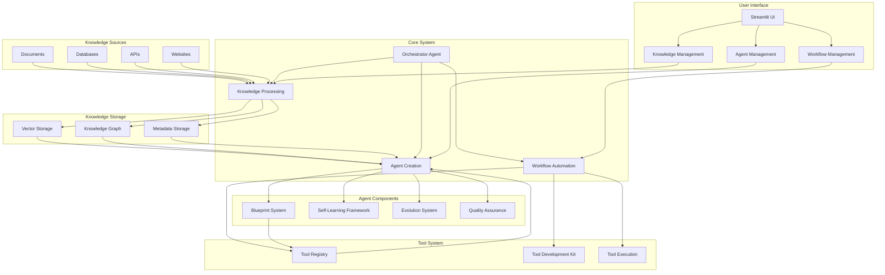
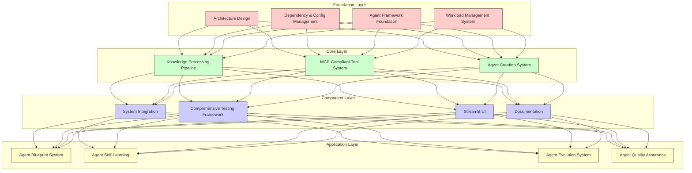
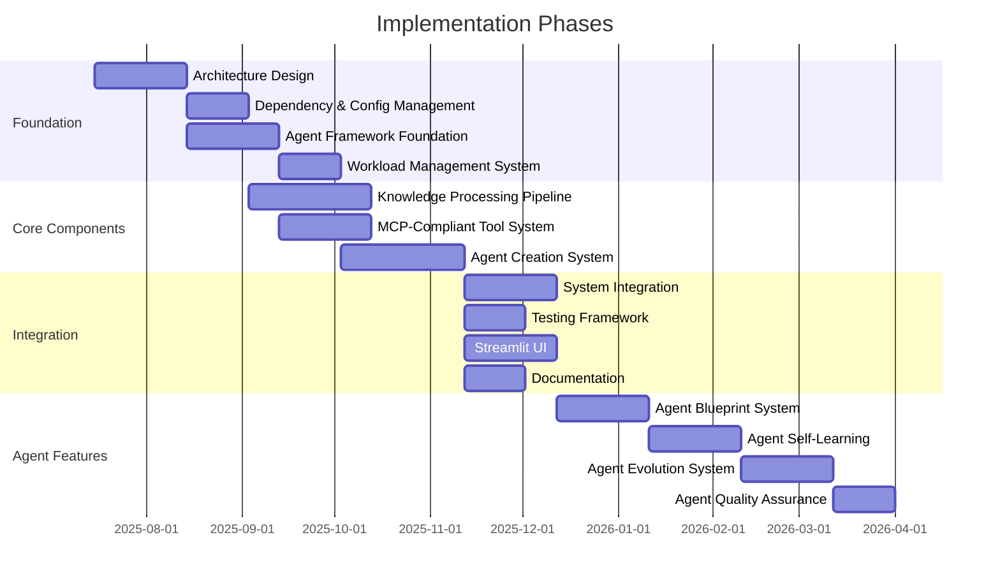
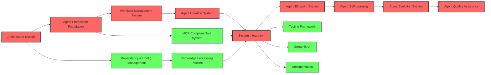
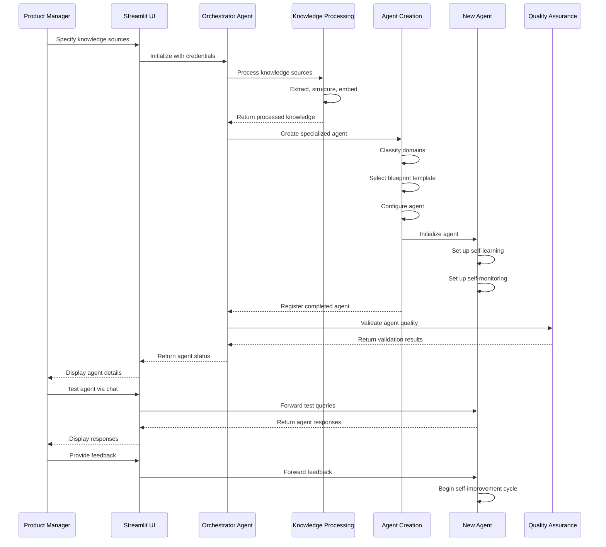
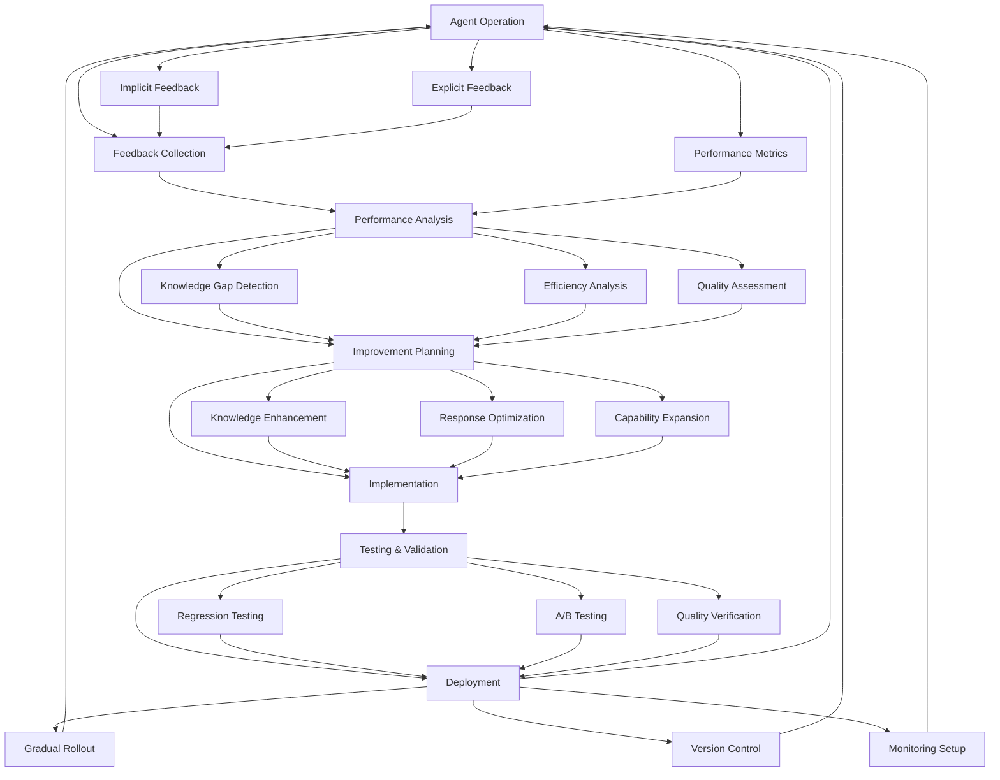
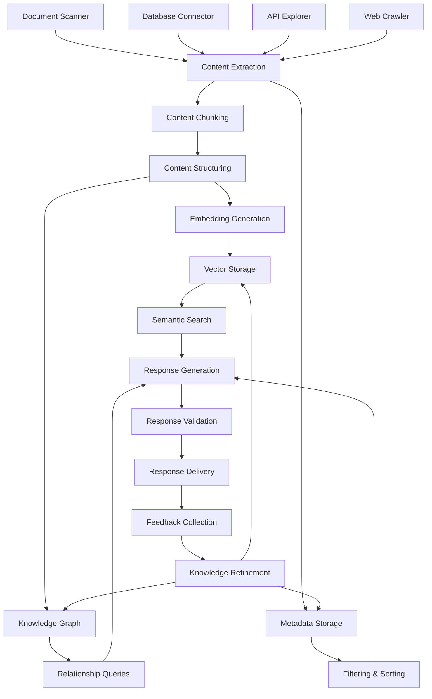

# Visual Summary of Autonomous AI Agent Creator System

This document provides a visual overview of the key components and their relationships in the Autonomous AI Agent Creator System.

## System Architecture Overview

```mermaid
graph TD
    classDef core fill:#f9f,stroke:#333,stroke-width:2px
    classDef processing fill:#bbf,stroke:#333,stroke-width:1px
    classDef agents fill:#bfb,stroke:#333,stroke-width:1px
    classDef tools fill:#fbb,stroke:#333,stroke-width:1px
    classDef ui fill:#ffb,stroke:#333,stroke-width:1px

    A[Orchestrator Agent] --> B[Knowledge Discovery]
    A --> C[Knowledge Processing]
    A --> D[Agent Creation]
    A --> E[Integration & Routing]
    A --> F[Evaluation & Improvement]
    A --> G[Workflow Automation]
    A --> H[Human Intervention Interface]
    
    B --> B1[Document Scanner]
    B --> B2[Database Connector]
    B --> B3[API Explorer]
    B --> B4[Web Crawler]
    
    C --> C1[Content Extraction]
    C --> C2[Knowledge Structuring]
    C --> C3[Embedding Generation]
    C --> C4[Vector Storage]
    C --> C5[Knowledge Graph]
    
    D --> D1[Domain Classification]
    D --> D2[Agent Blueprint System]
    D --> D3[Agent Self-Learning]
    D --> D4[Agent Evolution]
    D --> D5[Agent Quality Assurance]
    
    E --> E1[Topic Router]
    E --> E2[Context Manager]
    E --> E3[Response Synthesizer]
    
    F --> F1[Feedback Collection]
    F --> F2[Performance Metrics]
    F --> F3[Knowledge Gap Detection]
    F --> F4[Agent Retraining]
    
    G --> G1[API-to-Tool Conversion]
    G --> G2[Workflow Definition]
    G --> G3[Workflow Execution]
    G --> G4[Workflow Monitoring]
    
    H --> H1[Knowledge Source Review]
    H --> H2[Agent Configuration Review]
    H --> H3[Response Override]
    H --> H4[Manual Retraining]
    
    UI[Streamlit UI] --> A
    UI --> H
    
    A:::core
    B:::processing
    C:::processing
    D:::agents
    E:::agents
    F:::agents
    G:::tools
    H:::ui
    UI:::ui
```



## Component Relationships and Data Flow



## System Layers and Dependencies



## Implementation Phases and Dependencies



## Critical Path Analysis



## Agent Creation Process Flow



## Self-Improvement Cycle



## Component Interaction in Knowledge Processing



## Tool System Architecture

```mermaid
graph TD
    A[MCP SDK Integration] --> B[Tool Interface Definition]
    B --> C[Parameter Schema]
    B --> D[Result Schema]
    
    A --> E[Tool Registry]
    E --> F[Tool Discovery]
    E --> G[Tool Metadata]
    E --> H[Tool Versioning]
    
    A --> I[Tool Development Kit]
    I --> J[Tool Templates]
    I --> K[Tool Testing]
    I --> L[Tool Documentation]
    
    A --> M[Tool Execution Engine]
    M --> N[Parameter Validation]
    M --> O[Execution Management]
    M --> P[Result Handling]
    M --> Q[Error Management]
    
    R[API-to-Tool Conversion] --> B
    R --> E
    R --> I
    
    S[Agent Creation System] --> E
    S --> M
    
    T[Workflow Automation] --> E
    T --> M
    
    U[Streamlit UI] --> E
    U --> I
    U --> M