# Visual Summary of Design Principles Inheritance and Client Ownership

This document provides visual representations of how design principles are inherited across components and how the client ownership model is integrated into the system architecture.

## Design Principles Inheritance Flow

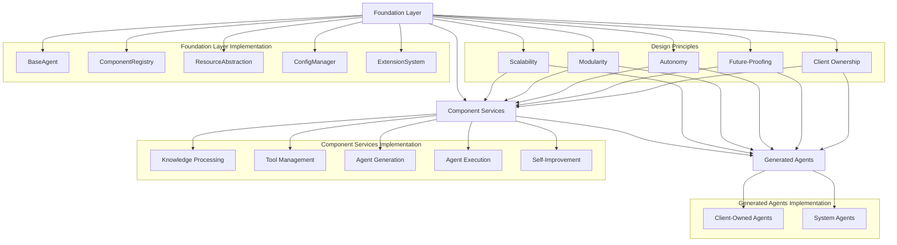

## Client Ownership Model Integration

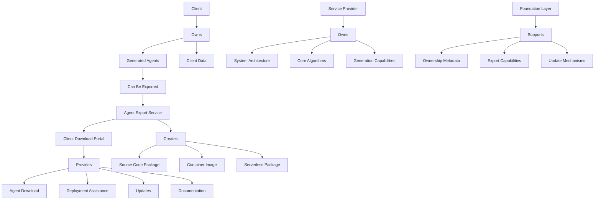

## Component Updates for Client Ownership

```mermaid
graph TD
    A[BaseAgent] --> B[Add Ownership Metadata]
    A --> C[Add Export Preparation]
    
    D[ComponentRegistry] --> E[Add Ownership Tracking]
    D --> F[Add Component Ownership Queries]
    
    G[ResourceAbstraction] --> H[Add Export Packaging]
    G --> I[Add Client Resource Isolation]
    
    J[ConfigManager] --> K[Add Client-Specific Configurations]
    J --> L[Add Configuration Export]
    
    M[Agent Generation Service] --> N[Add Ownership Assignment]
    M --> O[Add Export Format Selection]
    
    P[Agent Execution Service] --> Q[Add Remote Monitoring]
    P --> R[Add Secure Communication]
    
    S[Self-Improvement Service] --> T[Add Client-Controlled Learning]
    S --> U[Add Update Delivery]
```

## Design Principles Implementation in Client Agents

### Scalability Implementation

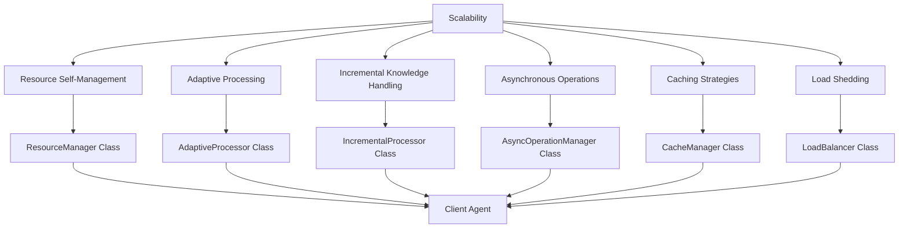

### Modularity Implementation

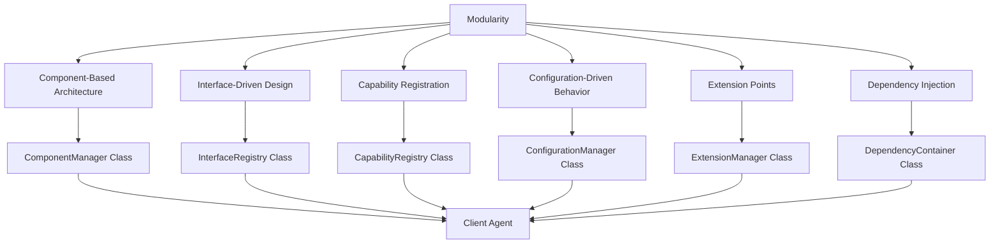

### Autonomy Implementation

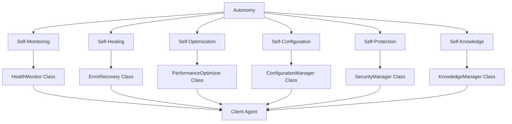

### Future-Proofing Implementation

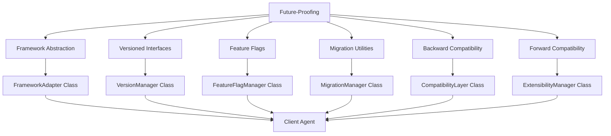

### Client Ownership Implementation

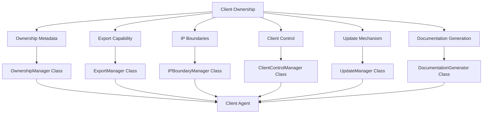

## Implementation Timeline

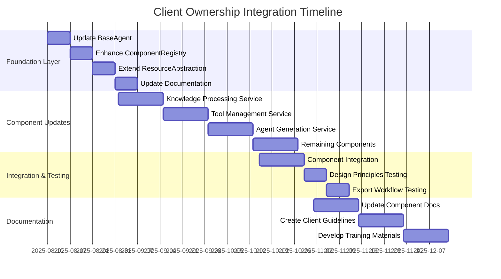

## Client Ownership Workflow

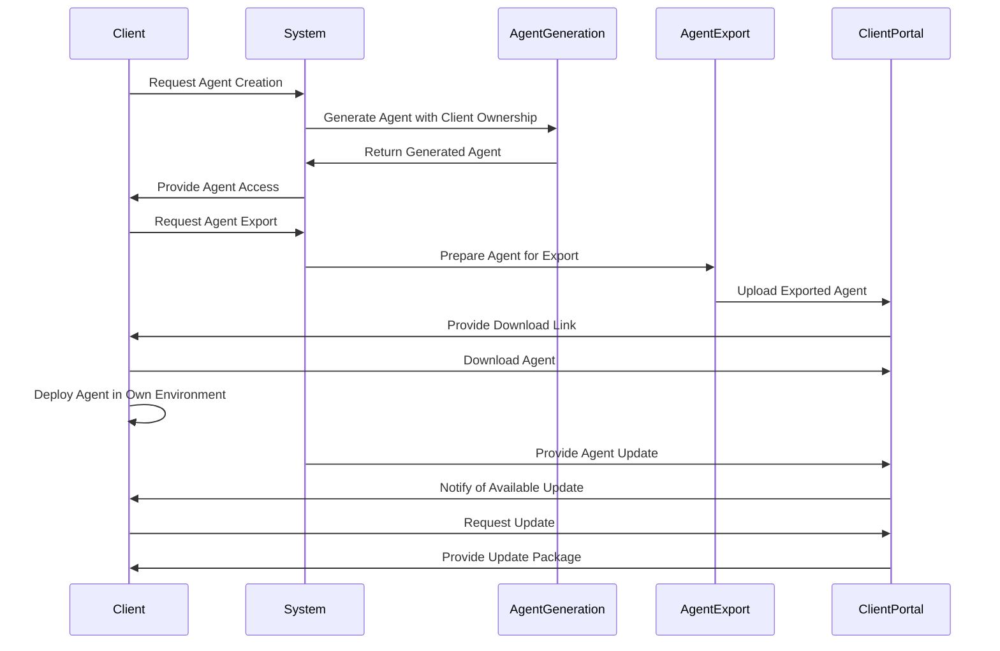

## Design Principles Inheritance Mechanism

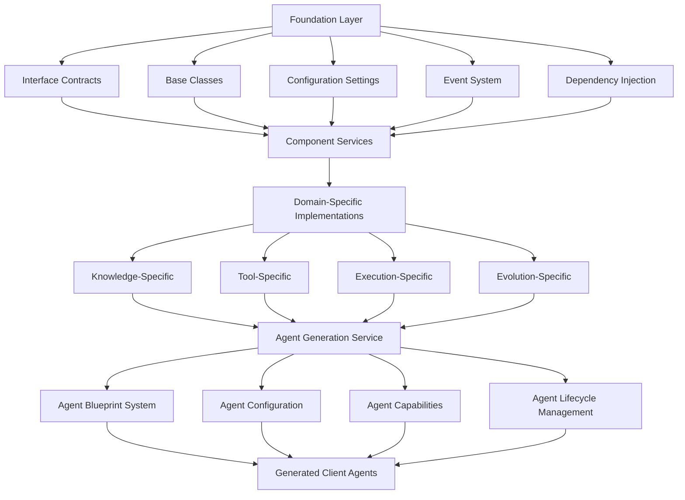

This visual summary provides a clear representation of how design principles are inherited across components and how the client ownership model is integrated into the system architecture. These diagrams can be used as a reference during implementation to ensure that all aspects of the design are properly addressed.